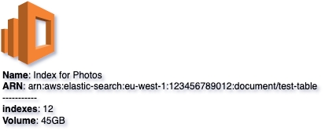

# Elastic Search Service
{: .d-inline-block .no_toc }

New (v0.3.22)
{: .label .label-green }

## Table of contents
{: .no_toc .text-delta }

1. TOC
{:toc}

---


## Node Type: ``elasticsearch_service``

## Rendering:



## Code Snippet:

```python

```

## drawio elasticsearch_service vertex:

```xml
<mxCell id="vertex:elasticsearch_service:arn:aws:elastic-search:eu-west-1:123456789012:document/test-table" parent="1" vertex="1">
    <mxGeometry width="67.5" height="81" as="geometry"/>
</mxCell>
```
---

## Advanced for Geeks:

### Style:
```html
style="outlineConnect=0;dashed=0;verticalLabelPosition=bottom;verticalAlign=top;align=left;html=1;shape=mxgraph.aws3.elasticsearch_service;fillColor=#F58534;gradientColor=none;"
```

| attribute | value |
|:----------|:------|
|align| left |
|dashed| 0 |
|fillColor| #F58534 |
|gradientColor| none |
|html| 1 |
|outlineConnect| 0 |
|shape| mxgraph.aws3.elasticsearch_service |
|verticalAlign| top |
|verticalLabelPosition| bottom |

### Vertex size:

| attribute | value |
|:---------|:-----------|
| width    | 67.5  |
| height   |81|

### Full XML dump:
```xml
<mxfile host="multicloud-diagrams" agent="PIP package multicloud-diagrams. Generate resources in draw.io compatible format for Cloud infrastructure. Copyrights @ Roman Tsypuk 2023. MIT license." type="MultiCloud">
    <diagram id="diagram_1" name="AWS components">
        <mxGraphModel dx="1015" dy="661" grid="1" gridSize="10" guides="1" tooltips="1" connect="1" arrows="1" fold="1" page="1" pageScale="1" pageWidth="850" pageHeight="1100" math="0" shadow="1">
            <root>
                <mxCell id="0"/>
                <mxCell id="1" parent="0"/>
                <mxCell id="vertex:elasticsearch_service:arn:aws:elastic-search:eu-west-1:123456789012:document/test-table" value="&lt;b&gt;Name&lt;/b&gt;: Index for Photos&lt;BR&gt;&lt;b&gt;ARN&lt;/b&gt;: arn:aws:elastic-search:eu-west-1:123456789012:document/test-table&lt;BR&gt;-----------&lt;BR&gt;&lt;b&gt;indexes&lt;/b&gt;: 12&lt;BR&gt;&lt;b&gt;Volume&lt;/b&gt;: 45GB" style="outlineConnect=0;dashed=0;verticalLabelPosition=bottom;verticalAlign=top;align=left;html=1;shape=mxgraph.aws3.elasticsearch_service;fillColor=#F58534;gradientColor=none;" parent="1" vertex="1">
                    <mxGeometry width="67.5" height="81" as="geometry"/>
                </mxCell>
            </root>
        </mxGraphModel>
    </diagram>
</mxfile>
```

### drawio file:

Download generated ``elasticsearch_service.drawio``:

[Download](output/drawio/elasticsearch_service.drawio){: .btn .btn-purple }