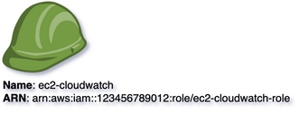

# IAM Role
{: .d-inline-block }

New (v0.2.0)
{: .label .label-green }

## Node Type: ``iam_role``

## Code Snippet:

```python

```

## Rendering:



## drawio iam_role vertex:

```xml
<?xml version="1.0" ?>
<mxCell id="vertex:iam_role:arn:aws:iam::123456789012:role/ec2-cloudwatch-role" parent="1" vertex="1">
    <mxGeometry width="94.5" height="79.5" as="geometry"/>
</mxCell>
```

## Advanced for Geeks:

### Style:
```html
style="outlineConnect=0;dashed=0;verticalLabelPosition=bottom;verticalAlign=top;align=left;html=1;shape=mxgraph.aws3.role;fillColor=#759C3E;gradientColor=none;"
```

| attribute | value |
|:----------|:------|
                |align| left |
                |dashed| 0 |
                |fillColor| #759C3E |
                |gradientColor| none |
                |html| 1 |
                |outlineConnect| 0 |
                |shape| mxgraph.aws3.role |
                |verticalAlign| top |
                |verticalLabelPosition| bottom |
    
### Vertex size:

| width    | 94.5  |
|:---------|:-----------|
| height   | 79.5 |

### Full XML dump:
```xml
        <?xml version="1.0" ?>
<mxfile host="multicloud-diagrams" agent="PIP package multicloud-diagrams. Generate resources in draw.io compatible format for Cloud infrastructure. Copyrights @ Roman Tsypuk 2023. MIT license." type="MultiCloud">
    <diagram id="diagram_1" name="AWS components">
        <mxGraphModel dx="1015" dy="661" grid="1" gridSize="10" guides="1" tooltips="1" connect="1" arrows="1" fold="1" page="1" pageScale="1" pageWidth="850" pageHeight="1100" math="0" shadow="1">
            <root>
                <mxCell id="0"/>
                <mxCell id="1" parent="0"/>
                <mxCell id="vertex:iam_role:arn:aws:iam::123456789012:role/ec2-cloudwatch-role" value="&lt;b&gt;Name&lt;/b&gt;: ec2-cloudwatch&lt;BR&gt;&lt;b&gt;ARN&lt;/b&gt;: arn:aws:iam::123456789012:role/ec2-cloudwatch-role" style="outlineConnect=0;dashed=0;verticalLabelPosition=bottom;verticalAlign=top;align=left;html=1;shape=mxgraph.aws3.role;fillColor=#759C3E;gradientColor=none;" parent="1" vertex="1">
                    <mxGeometry width="94.5" height="79.5" as="geometry"/>
                </mxCell>
            </root>
        </mxGraphModel>
    </diagram>
</mxfile>
```

### drawio file:

Download generated ``iam_role.drawio``:

[Download](output/drawio/iam_role.drawio){: .btn .btn-purple }