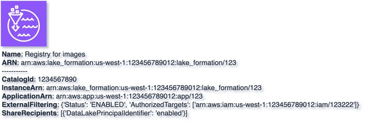

# Lake Formation
{: .d-inline-block .no_toc }

New (v)
{: .label .label-green }

## Table of contents
{: .no_toc .text-delta }

1. TOC
{:toc}

---


## Node Type: ``lake_formation``

## Rendering:



## Code Snippet:

```python

```

## drawio lake_formation vertex:

```xml
<mxCell id="vertex:lake_formation:arn:aws:lake_formation:us-west-1:123456789012:lake_formation/123" parent="1" vertex="1">
    <mxGeometry width="78" height="78" as="geometry"/>
</mxCell>
```
---

## Advanced for Geeks:

### Style:
```html
style="sketch=0;outlineConnect=0;fontColor=#232F3E;fillColor=#8C4FFF;strokeColor=#ffffff;dashed=0;verticalLabelPosition=bottom;verticalAlign=top;align=left;html=1;fontSize=12;fontStyle=0;aspect=fixed;shape=mxgraph.aws4.resourceIcon;resIcon=mxgraph.aws4.lake_formation;"
```

| attribute | value |
|:----------|:------|
|align| left |
|aspect| fixed |
|dashed| 0 |
|fillColor| #8C4FFF |
|fontColor| #232F3E |
|fontSize| 12 |
|fontStyle| 0 |
|html| 1 |
|outlineConnect| 0 |
|resIcon| mxgraph.aws4.lake_formation |
|shape| mxgraph.aws4.resourceIcon |
|sketch| 0 |
|strokeColor| #ffffff |
|verticalAlign| top |
|verticalLabelPosition| bottom |

### Vertex size:

| attribute | value |
|:---------|:-----------|
| width    | 78  |
| height   |78|

### Full XML dump:
```xml
<mxfile host="multicloud-diagrams" agent="PIP package multicloud-diagrams. Generate resources in draw.io compatible format for Cloud infrastructure. Copyrights @ Roman Tsypuk 2023. MIT license." type="MultiCloud">
    <diagram id="diagram_1" name="AWS components">
        <mxGraphModel dx="1015" dy="661" grid="1" gridSize="10" guides="1" tooltips="1" connect="1" arrows="1" fold="1" page="1" pageScale="1" pageWidth="850" pageHeight="1100" math="0" shadow="1">
            <root>
                <mxCell id="0"/>
                <mxCell id="1" parent="0"/>
                <mxCell id="vertex:lake_formation:arn:aws:lake_formation:us-west-1:123456789012:lake_formation/123" value="&lt;b&gt;Name&lt;/b&gt;: Registry for images&lt;BR&gt;&lt;b&gt;ARN&lt;/b&gt;: arn:aws:lake_formation:us-west-1:123456789012:lake_formation/123&lt;BR&gt;-----------&lt;BR&gt;&lt;b&gt;CatalogId&lt;/b&gt;: 1234567890&lt;BR&gt;&lt;b&gt;InstanceArn&lt;/b&gt;: arn:aws:lake_formation:us-west-1:123456789012:lake_formation/123&lt;BR&gt;&lt;b&gt;ApplicationArn&lt;/b&gt;: arn:aws:app:us-west-1:123456789012:app/123&lt;BR&gt;&lt;b&gt;ExternalFiltering&lt;/b&gt;: {'Status': 'ENABLED', 'AuthorizedTargets': ['arn:aws:iam:us-west-1:123456789012:iam/123222']}&lt;BR&gt;&lt;b&gt;ShareRecipients&lt;/b&gt;: [{'DataLakePrincipalIdentifier': 'enabled'}]" style="sketch=0;outlineConnect=0;fontColor=#232F3E;fillColor=#8C4FFF;strokeColor=#ffffff;dashed=0;verticalLabelPosition=bottom;verticalAlign=top;align=left;html=1;fontSize=12;fontStyle=0;aspect=fixed;shape=mxgraph.aws4.resourceIcon;resIcon=mxgraph.aws4.lake_formation;" parent="1" vertex="1">
                    <mxGeometry width="78" height="78" as="geometry"/>
                </mxCell>
            </root>
        </mxGraphModel>
    </diagram>
</mxfile>
```

### drawio file:

Download generated ``lake_formation.drawio``:

[Download](output/drawio/lake_formation.drawio){: .btn .btn-purple }