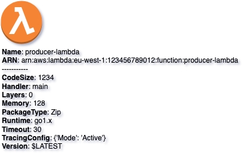

# Lambda Function
{: .d-inline-block }

New (v0.2.0)
{: .label .label-green }

## Node Type: ``lambda_function``

## Code Snippet:

```python

```

## Rendering:



## drawio lambda_function vertex:

```xml
<?xml version="1.0" ?>
<mxCell id="vertex:lambda_function:arn:aws:lambda:eu-west-1:123456789012:function:producer-lambda" parent="1" vertex="1">
    <mxGeometry width="69" height="72" as="geometry"/>
</mxCell>
```

## Advanced for Geeks:

### Style:
```html
style="verticalLabelPosition=bottom;verticalAlign=top;aspect=fixed;align=left;pointerEvents=1;shape=mxgraph.aws3.lambda_function;prIcon=server;fillColor=#F58534;gradientColor=none;html=1;"
```

| attribute | value |
|:----------|:------|
|align| left |
|aspect| fixed |
|fillColor| #F58534 |
|gradientColor| none |
|html| 1 |
|pointerEvents| 1 |
|prIcon| server |
|shape| mxgraph.aws3.lambda_function |
|verticalAlign| top |
|verticalLabelPosition| bottom |

### Vertex size:

| attribute | value |
|:---------|:-----------|
| width    | 69  |
| height   |72|

### Full XML dump:
```xml
        <?xml version="1.0" ?>
<mxfile host="multicloud-diagrams" agent="PIP package multicloud-diagrams. Generate resources in draw.io compatible format for Cloud infrastructure. Copyrights @ Roman Tsypuk 2023. MIT license." type="MultiCloud">
    <diagram id="diagram_1" name="AWS components">
        <mxGraphModel dx="1015" dy="661" grid="1" gridSize="10" guides="1" tooltips="1" connect="1" arrows="1" fold="1" page="1" pageScale="1" pageWidth="850" pageHeight="1100" math="0" shadow="1">
            <root>
                <mxCell id="0"/>
                <mxCell id="1" parent="0"/>
                <mxCell id="vertex:lambda_function:arn:aws:lambda:eu-west-1:123456789012:function:producer-lambda" value="&lt;b&gt;Name&lt;/b&gt;: producer-lambda&lt;BR&gt;&lt;b&gt;ARN&lt;/b&gt;: arn:aws:lambda:eu-west-1:123456789012:function:producer-lambda&lt;BR&gt;-----------&lt;BR&gt;&lt;b&gt;CodeSize&lt;/b&gt;: 1234&lt;BR&gt;&lt;b&gt;Handler&lt;/b&gt;: main&lt;BR&gt;&lt;b&gt;Layers&lt;/b&gt;: 0&lt;BR&gt;&lt;b&gt;Memory&lt;/b&gt;: 128&lt;BR&gt;&lt;b&gt;PackageType&lt;/b&gt;: Zip&lt;BR&gt;&lt;b&gt;Runtime&lt;/b&gt;: go1.x&lt;BR&gt;&lt;b&gt;Timeout&lt;/b&gt;: 30&lt;BR&gt;&lt;b&gt;TracingConfig&lt;/b&gt;: {'Mode': 'Active'}&lt;BR&gt;&lt;b&gt;Version&lt;/b&gt;: $LATEST" style="verticalLabelPosition=bottom;verticalAlign=top;aspect=fixed;align=left;pointerEvents=1;shape=mxgraph.aws3.lambda_function;prIcon=server;fillColor=#F58534;gradientColor=none;html=1;" parent="1" vertex="1">
                    <mxGeometry width="69" height="72" as="geometry"/>
                </mxCell>
            </root>
        </mxGraphModel>
    </diagram>
</mxfile>
```

### drawio file:

Download generated ``lambda_function.drawio``:

[Download](output/drawio/lambda_function.drawio){: .btn .btn-purple }