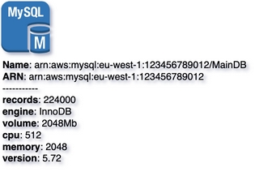

# MySQL
{: .d-inline-block .no_toc }

New (v0.3.20)
{: .label .label-green }

## Table of contents
{: .no_toc .text-delta }

1. TOC
{:toc}

---


## Node Type: ``mysql``

## Rendering:



## Code Snippet:

```python

```

## drawio mysql vertex:

```xml
<mxCell id="vertex:mysql:arn:aws:mysql:eu-west-1:123456789012" parent="1" vertex="1">
    <mxGeometry width="60" height="64.5" as="geometry"/>
</mxCell>
```
---

## Advanced for Geeks:

### Style:
```html
style="outlineConnect=0;dashed=0;verticalLabelPosition=bottom;verticalAlign=top;align=left;html=1;shape=mxgraph.aws3.mysql_db_instance;fillColor=#2E73B8;gradientColor=none;labelBackgroundColor=none;"
```

| attribute | value |
|:----------|:------|
|align| left |
|dashed| 0 |
|fillColor| #2E73B8 |
|gradientColor| none |
|html| 1 |
|labelBackgroundColor| none |
|outlineConnect| 0 |
|shape| mxgraph.aws3.mysql_db_instance |
|verticalAlign| top |
|verticalLabelPosition| bottom |

### Vertex size:

| attribute | value |
|:---------|:-----------|
| width    | 60  |
| height   |64.5|

### Full XML dump:
```xml
<mxfile host="multicloud-diagrams" agent="PIP package multicloud-diagrams. Generate resources in draw.io compatible format for Cloud infrastructure. Copyrights @ Roman Tsypuk 2023. MIT license." type="MultiCloud">
    <diagram id="diagram_1" name="AWS components">
        <mxGraphModel dx="1015" dy="661" grid="1" gridSize="10" guides="1" tooltips="1" connect="1" arrows="1" fold="1" page="1" pageScale="1" pageWidth="850" pageHeight="1100" math="0" shadow="1">
            <root>
                <mxCell id="0"/>
                <mxCell id="1" parent="0"/>
                <mxCell id="vertex:mysql:arn:aws:mysql:eu-west-1:123456789012" value="&lt;b&gt;Name&lt;/b&gt;: arn:aws:mysql:eu-west-1:123456789012/MainDB&lt;BR&gt;&lt;b&gt;ARN&lt;/b&gt;: arn:aws:mysql:eu-west-1:123456789012&lt;BR&gt;-----------&lt;BR&gt;&lt;b&gt;records&lt;/b&gt;: 224000&lt;BR&gt;&lt;b&gt;engine&lt;/b&gt;: InnoDB&lt;BR&gt;&lt;b&gt;volume&lt;/b&gt;: 2048Mb&lt;BR&gt;&lt;b&gt;cpu&lt;/b&gt;: 512&lt;BR&gt;&lt;b&gt;memory&lt;/b&gt;: 2048&lt;BR&gt;&lt;b&gt;version&lt;/b&gt;: 5.72" style="outlineConnect=0;dashed=0;verticalLabelPosition=bottom;verticalAlign=top;align=left;html=1;shape=mxgraph.aws3.mysql_db_instance;fillColor=#2E73B8;gradientColor=none;labelBackgroundColor=none;" parent="1" vertex="1">
                    <mxGeometry width="60" height="64.5" as="geometry"/>
                </mxCell>
            </root>
        </mxGraphModel>
    </diagram>
</mxfile>
```

### drawio file:

Download generated ``mysql.drawio``:

[Download](output/drawio/mysql.drawio){: .btn .btn-purple }