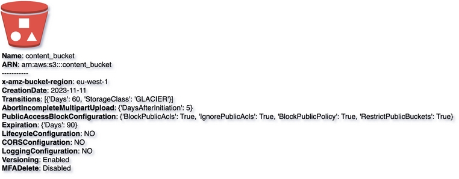

# S3
{: .d-inline-block }

New (v0.2.0)
{: .label .label-green }

## Node Type: ``s3``

## Code Snippet:

```python

```

## Rendering:



## drawio s3 vertex:

```xml
<?xml version="1.0" ?>
<mxCell id="vertex:s3:arn:aws:s3:::content_bucket" parent="1" vertex="1">
    <mxGeometry width="78" height="78" as="geometry"/>
</mxCell>
```

## Advanced for Geeks:

### Style:
```html
style="outlineConnect=0;dashed=0;verticalLabelPosition=bottom;verticalAlign=top;align=left;html=1;shape=mxgraph.aws3.bucket_with_objects;fillColor=#E05243;gradientColor=none;"
```

| attribute | value |
|:----------|:------|
|align| left |
|dashed| 0 |
|fillColor| #E05243 |
|gradientColor| none |
|html| 1 |
|outlineConnect| 0 |
|shape| mxgraph.aws3.bucket_with_objects |
|verticalAlign| top |
|verticalLabelPosition| bottom |

### Vertex size:

| attribute | value |
|:---------|:-----------|
| width    | 78  |
| height   |78|

### Full XML dump:
```xml
        <?xml version="1.0" ?>
<mxfile host="multicloud-diagrams" agent="PIP package multicloud-diagrams. Generate resources in draw.io compatible format for Cloud infrastructure. Copyrights @ Roman Tsypuk 2023. MIT license." type="MultiCloud">
    <diagram id="diagram_1" name="AWS components">
        <mxGraphModel dx="1015" dy="661" grid="1" gridSize="10" guides="1" tooltips="1" connect="1" arrows="1" fold="1" page="1" pageScale="1" pageWidth="850" pageHeight="1100" math="0" shadow="1">
            <root>
                <mxCell id="0"/>
                <mxCell id="1" parent="0"/>
                <mxCell id="vertex:s3:arn:aws:s3:::content_bucket" value="&lt;b&gt;Name&lt;/b&gt;: content_bucket&lt;BR&gt;&lt;b&gt;ARN&lt;/b&gt;: arn:aws:s3:::content_bucket&lt;BR&gt;-----------&lt;BR&gt;&lt;b&gt;x-amz-bucket-region&lt;/b&gt;: eu-west-1&lt;BR&gt;&lt;b&gt;CreationDate&lt;/b&gt;: 2023-11-11&lt;BR&gt;&lt;b&gt;Transitions&lt;/b&gt;: [{'Days': 60, 'StorageClass': 'GLACIER'}]&lt;BR&gt;&lt;b&gt;AbortIncompleteMultipartUpload&lt;/b&gt;: {'DaysAfterInitiation': 5}&lt;BR&gt;&lt;b&gt;PublicAccessBlockConfiguration&lt;/b&gt;: {'BlockPublicAcls': True, 'IgnorePublicAcls': True, 'BlockPublicPolicy': True, 'RestrictPublicBuckets': True}&lt;BR&gt;&lt;b&gt;Expiration&lt;/b&gt;: {'Days': 90}&lt;BR&gt;&lt;b&gt;LifecycleConfiguration&lt;/b&gt;: NO&lt;BR&gt;&lt;b&gt;CORSConfiguration&lt;/b&gt;: NO&lt;BR&gt;&lt;b&gt;LoggingConfiguration&lt;/b&gt;: NO&lt;BR&gt;&lt;b&gt;Versioning&lt;/b&gt;: Enabled&lt;BR&gt;&lt;b&gt;MFADelete&lt;/b&gt;: Disabled" style="outlineConnect=0;dashed=0;verticalLabelPosition=bottom;verticalAlign=top;align=left;html=1;shape=mxgraph.aws3.bucket_with_objects;fillColor=#E05243;gradientColor=none;" parent="1" vertex="1">
                    <mxGeometry width="78" height="78" as="geometry"/>
                </mxCell>
            </root>
        </mxGraphModel>
    </diagram>
</mxfile>
```

### drawio file:

Download generated ``s3.drawio``:

[Download](output/drawio/s3.drawio){: .btn .btn-purple }