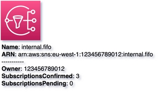

# SNS
{: .d-inline-block }

New (v0.2.0)
{: .label .label-green }


---

## Node Type: ``sns``

## Code Snippet:

```python

```

## Rendering:



## drawio sns vertex:

```xml
<mxCell id="vertex:sns:arn:aws:sns:eu-west-1:123456789012:internal.fifo" parent="1" vertex="1">
    <mxGeometry width="78" height="78" as="geometry"/>
</mxCell>
```
---

## Advanced for Geeks:

### Style:
```html
style="sketch=0;outlineConnect=0;fontColor=#232F3E;gradientColor=#FF4F8B;gradientDirection=north;fillColor=#BC1356;strokeColor=#ffffff;dashed=0;verticalLabelPosition=bottom;verticalAlign=top;align=left;html=1;fontSize=12;fontStyle=0;aspect=fixed;shape=mxgraph.aws4.resourceIcon;resIcon=mxgraph.aws4.sns;"
```

| attribute | value |
|:----------|:------|
|align| left |
|aspect| fixed |
|dashed| 0 |
|fillColor| #BC1356 |
|fontColor| #232F3E |
|fontSize| 12 |
|fontStyle| 0 |
|gradientColor| #FF4F8B |
|gradientDirection| north |
|html| 1 |
|outlineConnect| 0 |
|resIcon| mxgraph.aws4.sns |
|shape| mxgraph.aws4.resourceIcon |
|sketch| 0 |
|strokeColor| #ffffff |
|verticalAlign| top |
|verticalLabelPosition| bottom |

### Vertex size:

| attribute | value |
|:---------|:-----------|
| width    | 78  |
| height   |78|

### Full XML dump:
```xml
<mxfile host="multicloud-diagrams" agent="PIP package multicloud-diagrams. Generate resources in draw.io compatible format for Cloud infrastructure. Copyrights @ Roman Tsypuk 2023. MIT license." type="MultiCloud">
    <diagram id="diagram_1" name="AWS components">
        <mxGraphModel dx="1015" dy="661" grid="1" gridSize="10" guides="1" tooltips="1" connect="1" arrows="1" fold="1" page="1" pageScale="1" pageWidth="850" pageHeight="1100" math="0" shadow="1">
            <root>
                <mxCell id="0"/>
                <mxCell id="1" parent="0"/>
                <mxCell id="vertex:sns:arn:aws:sns:eu-west-1:123456789012:internal.fifo" value="&lt;b&gt;Name&lt;/b&gt;: internal.fifo&lt;BR&gt;&lt;b&gt;ARN&lt;/b&gt;: arn:aws:sns:eu-west-1:123456789012:internal.fifo&lt;BR&gt;-----------&lt;BR&gt;&lt;b&gt;Owner&lt;/b&gt;: 123456789012&lt;BR&gt;&lt;b&gt;SubscriptionsConfirmed&lt;/b&gt;: 3&lt;BR&gt;&lt;b&gt;SubscriptionsPending&lt;/b&gt;: 0" style="sketch=0;outlineConnect=0;fontColor=#232F3E;gradientColor=#FF4F8B;gradientDirection=north;fillColor=#BC1356;strokeColor=#ffffff;dashed=0;verticalLabelPosition=bottom;verticalAlign=top;align=left;html=1;fontSize=12;fontStyle=0;aspect=fixed;shape=mxgraph.aws4.resourceIcon;resIcon=mxgraph.aws4.sns;" parent="1" vertex="1">
                    <mxGeometry width="78" height="78" as="geometry"/>
                </mxCell>
            </root>
        </mxGraphModel>
    </diagram>
</mxfile>
```

### drawio file:

Download generated ``sns.drawio``:

[Download](output/drawio/sns.drawio){: .btn .btn-purple }