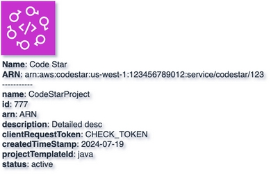

# CodeStar
{: .d-inline-block .no_toc }

New (v0.3.89)
{: .label .label-green }

## Table of contents
{: .no_toc .text-delta }

1. TOC
{:toc}

---


## Node Type: ``codestar``

## Rendering:



## Code Snippet:

```python

```

## drawio codestar vertex:

```xml
<mxCell id="vertex:codestar:arn:aws:codestar:us-west-1:123456789012:service/codestar/123" parent="1" vertex="1">
    <mxGeometry width="78" height="78" as="geometry"/>
</mxCell>
```
---

## Advanced for Geeks:

### Style:
```html
style="sketch=0;outlineConnect=0;fontColor=#232F3E;fillColor=#C925D1;strokeColor=#ffffff;dashed=0;verticalLabelPosition=bottom;verticalAlign=top;align=left;html=1;fontSize=12;fontStyle=0;aspect=fixed;shape=mxgraph.aws4.resourceIcon;resIcon=mxgraph.aws4.codestar;"
```

| attribute | value |
|:----------|:------|
|align| left |
|aspect| fixed |
|dashed| 0 |
|fillColor| #C925D1 |
|fontColor| #232F3E |
|fontSize| 12 |
|fontStyle| 0 |
|html| 1 |
|outlineConnect| 0 |
|resIcon| mxgraph.aws4.codestar |
|shape| mxgraph.aws4.resourceIcon |
|sketch| 0 |
|strokeColor| #ffffff |
|verticalAlign| top |
|verticalLabelPosition| bottom |

### Vertex size:

| attribute | value |
|:---------|:-----------|
| width    | 78  |
| height   |78|

### Full XML dump:
```xml
<mxfile host="multicloud-diagrams" agent="PIP package multicloud-diagrams. Generate resources in draw.io compatible format for Cloud infrastructure. Copyrights @ Roman Tsypuk 2023. MIT license." type="MultiCloud">
    <diagram id="diagram_1" name="AWS components">
        <mxGraphModel dx="1015" dy="661" grid="1" gridSize="10" guides="1" tooltips="1" connect="1" arrows="1" fold="1" page="1" pageScale="1" pageWidth="850" pageHeight="1100" math="0" shadow="1">
            <root>
                <mxCell id="0"/>
                <mxCell id="1" parent="0"/>
                <mxCell id="vertex:codestar:arn:aws:codestar:us-west-1:123456789012:service/codestar/123" value="&lt;b&gt;Name&lt;/b&gt;: Code Star&lt;BR&gt;&lt;b&gt;ARN&lt;/b&gt;: arn:aws:codestar:us-west-1:123456789012:service/codestar/123&lt;BR&gt;-----------&lt;BR&gt;&lt;b&gt;name&lt;/b&gt;: CodeStarProject&lt;BR&gt;&lt;b&gt;id&lt;/b&gt;: 777&lt;BR&gt;&lt;b&gt;arn&lt;/b&gt;: ARN&lt;BR&gt;&lt;b&gt;description&lt;/b&gt;: Detailed desc&lt;BR&gt;&lt;b&gt;clientRequestToken&lt;/b&gt;: CHECK_TOKEN&lt;BR&gt;&lt;b&gt;createdTimeStamp&lt;/b&gt;: 2024-07-19&lt;BR&gt;&lt;b&gt;projectTemplateId&lt;/b&gt;: java&lt;BR&gt;&lt;b&gt;status&lt;/b&gt;: active" style="sketch=0;outlineConnect=0;fontColor=#232F3E;fillColor=#C925D1;strokeColor=#ffffff;dashed=0;verticalLabelPosition=bottom;verticalAlign=top;align=left;html=1;fontSize=12;fontStyle=0;aspect=fixed;shape=mxgraph.aws4.resourceIcon;resIcon=mxgraph.aws4.codestar;" parent="1" vertex="1">
                    <mxGeometry width="78" height="78" as="geometry"/>
                </mxCell>
            </root>
        </mxGraphModel>
    </diagram>
</mxfile>
```

### drawio file:

Download generated ``codestar.drawio``:

[Download](output/drawio/codestar.drawio){: .btn .btn-purple }