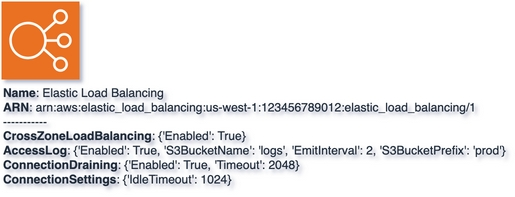

# Elastic Load Balancer
{: .d-inline-block .no_toc }

New (v0.3.78)
{: .label .label-green }

## Table of contents
{: .no_toc .text-delta }

1. TOC
{:toc}

---


## Node Type: ``elastic_load_balancing``

## Rendering:



## Code Snippet:

```python

```

## drawio elastic_load_balancing vertex:

```xml
<mxCell id="vertex:elastic_load_balancing:arn:aws:elastic_load_balancing:us-west-1:123456789012:elastic_load_balancing/1" parent="1" vertex="1">
    <mxGeometry width="78" height="78" as="geometry"/>
</mxCell>
```
---

## Advanced for Geeks:

### Style:
```html
style="sketch=0;outlineConnect=0;fontColor=#232F3E;fillColor=#ED7100;strokeColor=#ffffff;dashed=0;verticalLabelPosition=bottom;verticalAlign=top;align=left;html=1;fontSize=12;fontStyle=0;aspect=fixed;shape=mxgraph.aws4.resourceIcon;resIcon=mxgraph.aws4.elastic_load_balancing;"
```

| attribute | value |
|:----------|:------|
|align| left |
|aspect| fixed |
|dashed| 0 |
|fillColor| #ED7100 |
|fontColor| #232F3E |
|fontSize| 12 |
|fontStyle| 0 |
|html| 1 |
|outlineConnect| 0 |
|resIcon| mxgraph.aws4.elastic_load_balancing |
|shape| mxgraph.aws4.resourceIcon |
|sketch| 0 |
|strokeColor| #ffffff |
|verticalAlign| top |
|verticalLabelPosition| bottom |

### Vertex size:

| attribute | value |
|:---------|:-----------|
| width    | 78  |
| height   |78|

### Full XML dump:
```xml
<mxfile host="multicloud-diagrams" agent="PIP package multicloud-diagrams. Generate resources in draw.io compatible format for Cloud infrastructure. Copyrights @ Roman Tsypuk 2023. MIT license." type="MultiCloud">
    <diagram id="diagram_1" name="AWS components">
        <mxGraphModel dx="1015" dy="661" grid="1" gridSize="10" guides="1" tooltips="1" connect="1" arrows="1" fold="1" page="1" pageScale="1" pageWidth="850" pageHeight="1100" math="0" shadow="1">
            <root>
                <mxCell id="0"/>
                <mxCell id="1" parent="0"/>
                <mxCell id="vertex:elastic_load_balancing:arn:aws:elastic_load_balancing:us-west-1:123456789012:elastic_load_balancing/1" value="&lt;b&gt;Name&lt;/b&gt;: Elastic Load Balancing&lt;BR&gt;&lt;b&gt;ARN&lt;/b&gt;: arn:aws:elastic_load_balancing:us-west-1:123456789012:elastic_load_balancing/1&lt;BR&gt;-----------&lt;BR&gt;&lt;b&gt;CrossZoneLoadBalancing&lt;/b&gt;: {'Enabled': True}&lt;BR&gt;&lt;b&gt;AccessLog&lt;/b&gt;: {'Enabled': True, 'S3BucketName': 'logs', 'EmitInterval': 2, 'S3BucketPrefix': 'prod'}&lt;BR&gt;&lt;b&gt;ConnectionDraining&lt;/b&gt;: {'Enabled': True, 'Timeout': 2048}&lt;BR&gt;&lt;b&gt;ConnectionSettings&lt;/b&gt;: {'IdleTimeout': 1024}" style="sketch=0;outlineConnect=0;fontColor=#232F3E;fillColor=#ED7100;strokeColor=#ffffff;dashed=0;verticalLabelPosition=bottom;verticalAlign=top;align=left;html=1;fontSize=12;fontStyle=0;aspect=fixed;shape=mxgraph.aws4.resourceIcon;resIcon=mxgraph.aws4.elastic_load_balancing;" parent="1" vertex="1">
                    <mxGeometry width="78" height="78" as="geometry"/>
                </mxCell>
            </root>
        </mxGraphModel>
    </diagram>
</mxfile>
```

### drawio file:

Download generated ``elastic_load_balancing.drawio``:

[Download](output/drawio/elastic_load_balancing.drawio){: .btn .btn-purple }