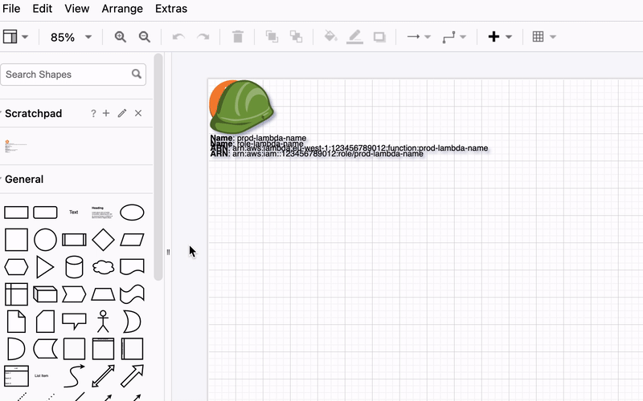
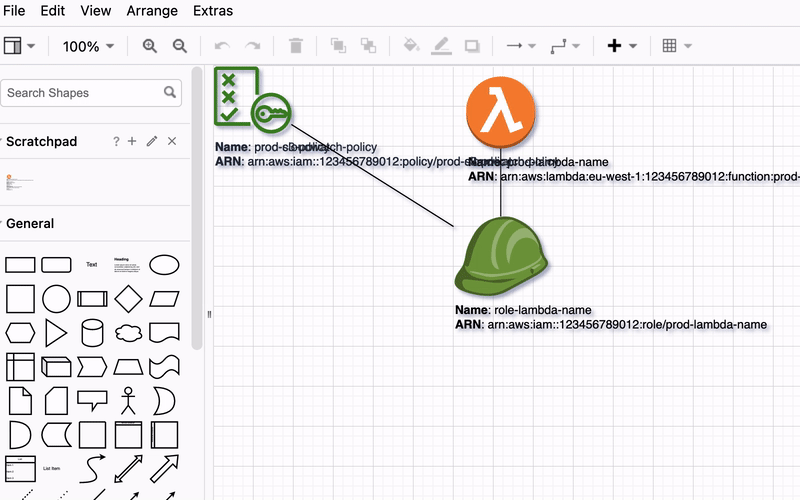
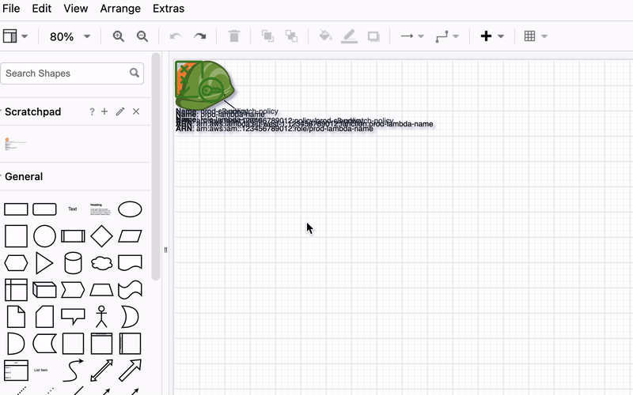

# Getting started
{: .no_toc }

Welcome to ``multicloud-diagrams`` 👋 This section will walk you through the basic installation process and provide a quick example to get you started.
If you're looking for more advanced features and customization options, be sure to explore the subsequent sections in our comprehensive documentation.

## Table of contents
{: .no_toc .text-delta }

1. TOC
{:toc}
---

## Dependency details

python-3.11
{: .label .label-green }

python-3.10
{: .label .label-green }

python-3.9
{: .label .label-green }

python-3.8
{: .label .label-green }

python-3.7
{: .label .label-yellow }

The ``multicloud-diagrams`` package is a Python library that provides support for major ``Python`` versions, including ``3.7``, ``3.8``, ``3.9``, ``3.10``, and ``3.11``.
The package ensures compatibility with these Python versions by running tests using a Git workflow.
These tests are designed to verify that the library functions as expected across each mentioned Python version.

Compatibility tests are included for latest LTS Python versions that have ``Security Support``.

| Release | Released    | Security Support | Latest  |  
|:--------|:------------|:-----------------|:--------|
| 3.11    | 24 Oct 2022 | 24 Oct 2027      | 3.11.4  |
| 3.10    | 04 Oct 2021 | 04 Oct 2026      | 3.10.12 |
| 3.9     | 05 Oct 2020 | 05 Oct 2025      | 3.9.1   |
| 3.8     | 14 Oct 2019 | 14 Oct 2024      | 3.8.17  |
| 3.7     | 26 Jun 2018 | 27 Jun 2023      | 3.7.17  |

{: .highlight }
>You can use ``multicloud-diagrams`` with ``Python`` versions ``<3.7`` that do not have official ``Security Support`` with your own verification.
>
>Since  ``27 Jun 2023`` Python ``3.7`` has no security support, ``multicloud-diagrams`` are still support this version (pipeline with full features compatibility check), however on next Python LTS releases
it will be deprecated. This evolution will enable us to seamlessly embrace the latest language features not accessible in the 3.7 release.

The package is readily accessible on [PyPI: https://pypi.org/project/multicloud-diagrams/](https://pypi.org/project/multicloud-diagrams/)
for easy installation and usage. As an open-source project, it encourages community participation and welcomes contributions from developers
[https://github.com/tsypuk/multicloud-diagrams](https://github.com/tsypuk/multicloud-diagrams)
Whether you want to use the package's functionalities or contribute to its improvement, it offers a user-friendly experience, backed by an active and engaged community.

## On-line Documentation is Dynamic and generated from Tests
{: .d-inline-block }

{: .highlight }
> All the resources within this documentation, including code snippets, rendered images, and XML dumps, are compiled and generated through tests conducted during the publishing process.
>
This comprehensive testing not only ensures verification but also guarantees that the provided examples remain current, up-to-date, aligning seamlessly with the latest API updates and method signatures.
> 
>Furthermore, the rendering process showcases authentic images, presenting an accurate desired output.

## Installation

You can install ``multicloud-diagrams`` using ``pip``, the package manager for Python:

```shell
pip install multicloud-diagrams
```

If you are using ``poetry`` follow these instructions:

```shell
poetry add multicloud-diagrams
```

Edit your ``project.toml`` and add ``multicloud-diagrams`` as dependency:

```yaml
[ tool.poetry.dependencies ]
  python = "^3.7"
  pyyaml = "^6.0"
  multicloud-diagrams = ^"{{ site.data['tag'] }}"
```

## Usage

{: .d-inline-block }

The minimum configuration requires importing MultiCloudDiagrams, adding vertices, connecting them with links and exporting to output file.

Let's add 2 vertices ``IAM Role`` and ``Lambda function``:

```python

```

## Open drawio editor and position nodes manually

{: .d-inline-block }

Considering that we haven't specified the coordinates or distribution algorithm yet (which will be detailed in the next instructions), by default, all elements will be placed in the left-top corner. 
We have the flexibility to move and position them according to our preferences.

<div class="code-example" markdown="1">

</div>

## Reuse coordinates from previous diagram version

{: .d-inline-block }

New (v0.2.1)
{: .label .label-green }

When we provide the path to an existing ``drawio`` file, the current context framework will read the coordinates of all vertices from the previous diagram and reuse them. 
As a result, any new elements will be added to the top-left corner by default, while existing elements will retain their original coordinates. 
If certain vertices were removed from the framework, they will not be present in the resulting ``drawio`` file. 

Now, we are adding 2 more vertices ``IAM Permissions`` to see how it works.

```python

```

This approach allows for efficient placement of new elements while preserving the layout of existing ones based on the previous diagram's coordinates.

<div class="code-example" markdown="1">

</div>

By leveraging this feature, we can implement versioning effectively by consistently reading coordinates from the previous file, 
which includes a timestamp (e.g., ``datetime`` in the file name). Subsequently, we write the updated elements to a new file. 
This functionality proves invaluable for tracking historical records and facilitating a comprehensive comparison of infrastructure evolution over time.

## Arrange Layout automatic positioning

<div class="code-example" markdown="1">

</div>

{: .highlight }
For more advanced use cases, detailed customization options, and in-depth functionalities, please continue exploring the next sections in our documentation. There, you will find a wealth of
information to help you leverage the full potential of ``multicloud-diagrams`` in your projects. Happy diagramming!