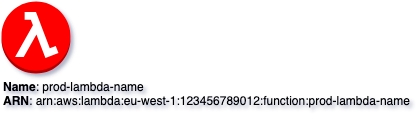
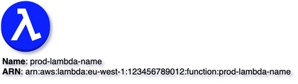
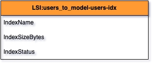

# Customization
{: .d-inline-block }

New (v0.3.12)
{: .label .label-green }

## Style

```python
style = {
    'fillColor': '#FF0000'
}
```

## Code Snippet:

```python

```

## Rendering:



### Full XML dump:

```xml

```

### drawio file:

Download generated ``color_red.drawio``:

[Download](output/drawio/color_red.drawio){: .btn .btn-purple }


## Code Snippet:

```python

```

## Rendering:



### Full XML dump:

```xml

```

### drawio file:

Download generated ``color_blue.drawio``:

[Download](output/drawio/color_blue.drawio){: .btn .btn-purple }


## Code Snippet:

```python

```

## Rendering:



### Full XML dump:

```xml

```

### drawio file:

Download generated ``color_table.drawio``:

[Download](output/drawio/color_table.drawio){: .btn .btn-purple }


