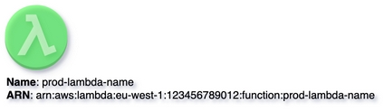
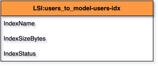

# Customizing Vertex
{: .d-inline-block  .no_toc}

New (v0.3.13)
{: .label .label-green }


## Table of contents
{: .no_toc .text-delta }

1. TOC
{:toc}

---

## Use Style Object to override any parameter

When passing ``style`` parameter, we can customize the representation of particular Vertex. Here is the list of most widely used
parameters of style.

```python
style = {
    'fillColor': '#FF0000',
    'fillOpacity': '50',
    'shadow': '1',
    'gradientColor': '#FFFF33',
    'gradientDirection': 'north'
}
```

{: .highlight }
Each Node in this documentation has full list of its style parameters. You can check all styles at ``Advanced for Geeks`` section.

## Changing FillColor to RED (node with Error or Alarm):

### Code Snippet:
{: .no_toc }

```python

```

## Rendering:
{: .no_toc }


## Adding Opacity and Background Shadow:

### Code Snippet:
{: .no_toc }

```python

```

## Rendering:
{: .no_toc }



## Gradient Fill

When specifying ``gradient fill`` it is mandatory to set 3 style params:
- fillColor
- gradientColor
- gradientDirection

``gradientDirection`` can have the following values:
- north
- south
- west
- east
- radial

## Code Snippet:
{: .no_toc }

```python

```

## Rendering:
{: .no_toc }


## Change the Direction of Vertex:

## Code Snippet:
{: .no_toc }

```python

```

## Rendering:
{: .no_toc }


## Vertex without any labels:

## Code Snippet:
{: .no_toc }

```python

```

## Rendering:
{: .no_toc }


## Applying Colors to Table

## Code Snippet:
{: .no_toc }

```python

```

## Rendering
{: .no_toc }



## Hiding NODE ID information when rendering

{: .highlight }
Extra parameter, **hide_id = true** allows to render only node name avoiding any additional information.

## Code Snippet:
{: .no_toc }

```python

```

## Rendering
{: .no_toc }


