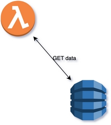
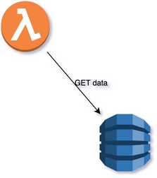
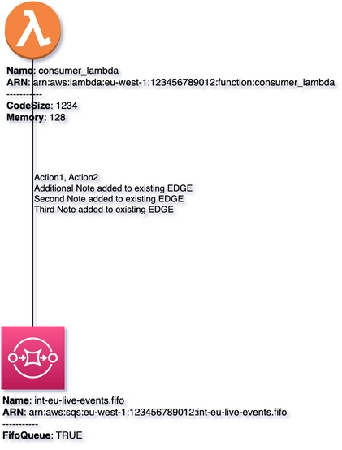

# Customizing Edge
{: .d-inline-block  .no_toc}

New (v0.3.13)
{: .label .label-green }


## Table of contents
{: .no_toc .text-delta }

1. TOC
{:toc}

---

## Style Object, Predefined Connections, Generic Customizer

When passing ``style`` parameter, we can customize the representation of particular Edge. Here is the list of most widely used
parameters of style (there are much mode of them, you can customize any).

```python
style = {
    'dashed': '1',
    'strokeColor': '#FF3333',
    'strokeWidth': '3',
    'orthogonalLoop': '1',
    'edgeStyle': 'orthogonalEdgeStyle',
    'curved': '1',
    'startArrow': 'oval',
    'endArrow': 'classicThin',
}
```

{: .highlight }
``multicloud-diagrams`` provides top level functions to apply defined styles based on name. Also, there is generic function ``add_connection``
that has ``style`` parameter to customize any style.

# Predefined Connections:

## Adding standard edge connection

### Code Snippet:
{: .no_toc }

```python

```

## Rendering:
{: .no_toc }


## Bidirectional Connection

### Code Snippet:
{: .no_toc }

```python

```

## Rendering:
{: .no_toc }



## Unidirectional Connection

### Code Snippet:
{: .no_toc }

```python

```

## Rendering:
{: .no_toc }



# Generic Customizer:

## Dashed Connection

### Code Snippet:
{: .no_toc }

```python

```

## Rendering:
{: .no_toc }


## Stroked Colored Connection

### Code Snippet:
{: .no_toc }

```python

```

## Rendering:
{: .no_toc }


## Rounded Connection

### Code Snippet:
{: .no_toc }

```python

```

## Rendering:
{: .no_toc }


## EdgeStyle Connection

### Code Snippet:
{: .no_toc }

```python

```

## Rendering:
{: .no_toc }


# Add additional note to existing Label of existing Edge

### Code Snippet:
{: .no_toc }

```python

```

## Rendering:
{: .no_toc }

