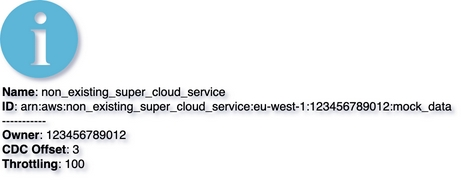

# Fallback Vertex
{: .d-inline-block }

New (v0.2.0)
{: .label .label-green }

{: .warning }
Fallback Vertex for node types that currently not present in the framework. The fallback icon will be rendered for such element. 
Also you will see console WARNING: No such nodeType: non_existing_super_cloud_service in the Library (using default fallback icon Info). Please contact maintainer to add it, or provide MergeRequest``
## Node Type: ``fallback_vertex``

## Code Snippet:

```python

```

## Rendering:




## drawio fallback_vertex vertex:

```xml
<?xml version="1.0" ?>
<mxCell id="vertex:non_existing_super_cloud_service:arn:aws:non_existing_super_cloud_service:eu-west-1:123456789012:mock_data" parent="1" vertex="1">
						
	<mxGeometry width="78" height="78" as="geometry"/>
					
</mxCell>

```

## Advanced for Geeks:

### Style:
```html
style="sketch=0;aspect=fixed;html=1;align=left;image;fontSize=12;image=img/lib/mscae/Info.svg;labelBackgroundColor=none;"
```
### Vertex size:

| width     | height   |
|:----------|:---------|
| 78 | 78|

### Full XML dump:
```xml
        <?xml version="1.0" ?>
<mxfile host="multicloud-diagrams" agent="PIP package multicloud-diagrams. Generate resources in draw.io compatible format for Cloud infrastructure. Copyrights @ Roman Tsypuk 2023. MIT license." type="MultiCloud">
		
	<diagram id="diagram_1" name="AWS components">
				
		<mxGraphModel dx="1015" dy="661" grid="1" gridSize="10" guides="1" tooltips="1" connect="1" arrows="1" fold="1" page="1" pageScale="1" pageWidth="850" pageHeight="1100" math="0" shadow="1">
						
			<root>
								
				<mxCell id="0"/>
								
				<mxCell id="1" parent="0"/>
								
				<mxCell id="vertex:non_existing_super_cloud_service:arn:aws:non_existing_super_cloud_service:eu-west-1:123456789012:mock_data" parent="1" vertex="1">
										
					<mxGeometry width="78" height="78" as="geometry"/>
									
				</mxCell>
							
			</root>
					
		</mxGraphModel>
			
	</diagram>
</mxfile>

```

### drawio file:

Download generated ``fallback_vertex.drawio``:

[Download](output/drawio/fallback_vertex.drawio){: .btn .btn-purple }