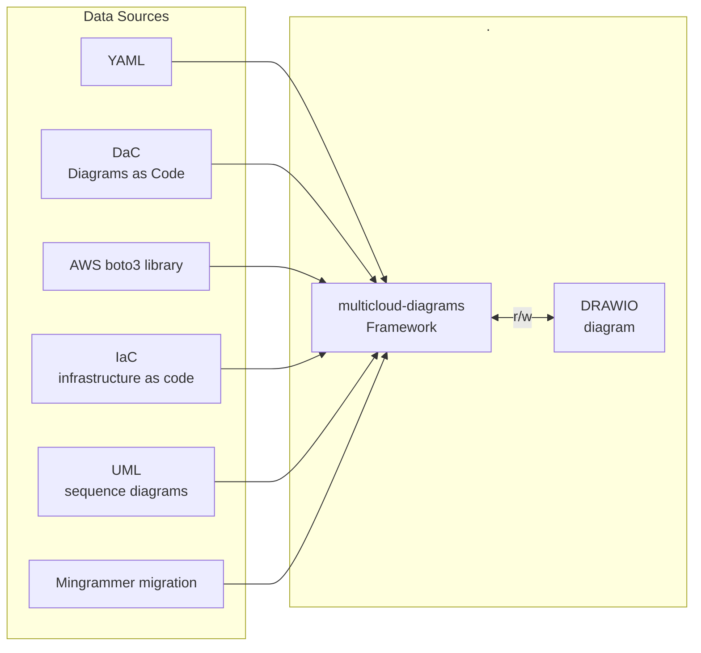

## Integration

{: .d-inline-block }
``Diagrams as a Code`` approach is initially implemented from early versions. You can track syntax of resources declaration
for [Core](/docs/core-components/), [AWS](/docs/aws-components/) and [On-Prem](/docs/onprem-components/) resources.

New (v0.2.1)
{: .label .label-green }

{: .d-inline-block }
ingestion resources declared in external ``YAML`` file

New (v0.3.8)
{: .label .label-green }

 
