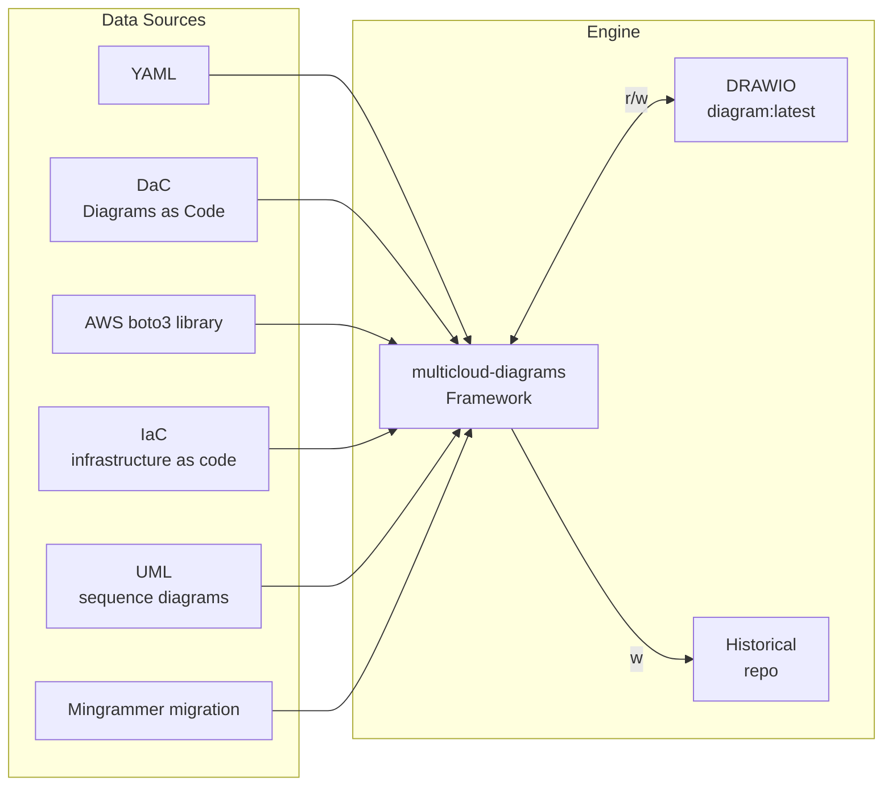

## Integration:

## Implemented Integartions:

- ``Diagrams as a Code`` approach is initially implemented from early versions. You can track syntax of resources declaration
for [Core](../core-components), [AWS](../aws-components) and [On-Prem](../onprem-components) resources.
- ingestion resources declared in [external ``YAML`` file](../core-components/yaml.html)
- augment from UML sequence diagrams [mermaid UML format](../core-components/uml.md)
- augment from UML sequence diagrams [plantuml UML format](../core-components/uml.md)
  