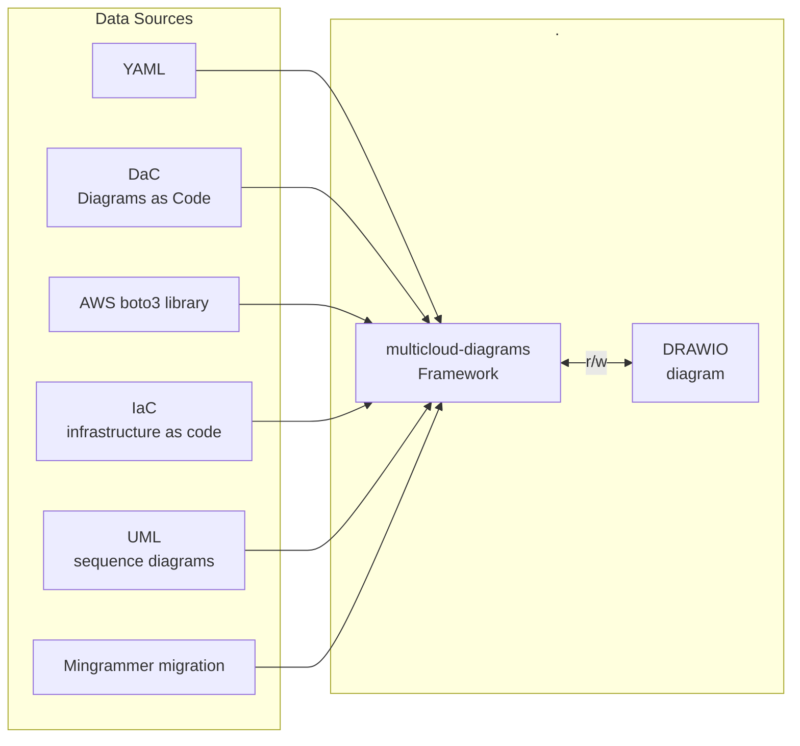

## Integration

- ``Diagrams as a Code`` approach is initially implemented from early versions. You can track syntax of resources declaration
for [Core](/docs/core-components/), [AWS](/docs/aws-components/) and [On-Prem](/docs/onprem-components/) resources.
- ingestion resources declared in [external ``YAML`` file](/docs/core-components/yaml.html)
  