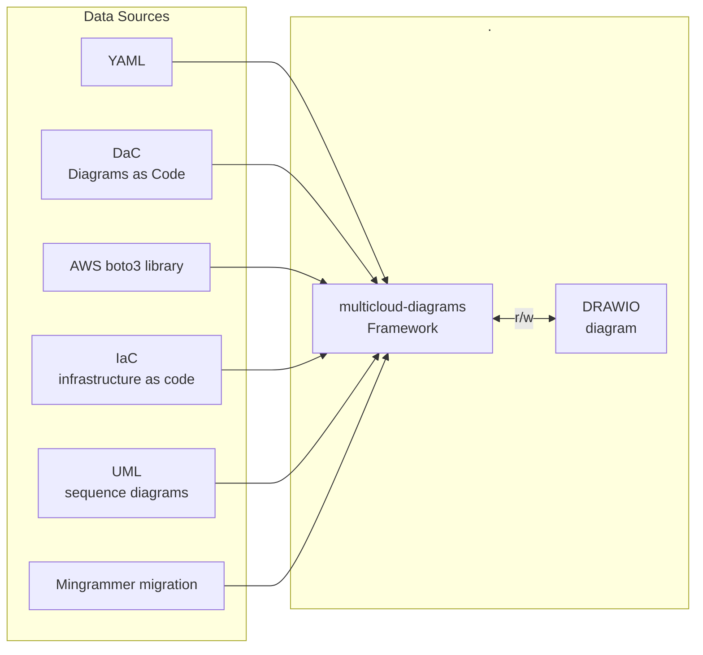

## Integration

```mermaid
flowchart LR
subgraph .
A[multicloud-diagrams\n Framework] <-->| r/w | B[DRAWIO \n diagram];
end

subgraph Data Sources
Y[YAML] --> A
D[DaC \n Diagrams as Code] --> A
BOTO3[AWS boto3 library] --> A
IAC[IaC \n infrastructure as code] --> A
UML[UML \n sequence diagrams] --> A
M[Mingrammer migration] --> A
end
```
