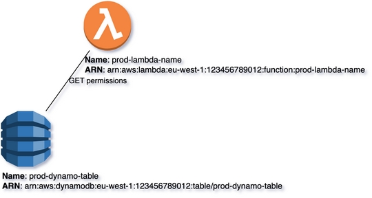
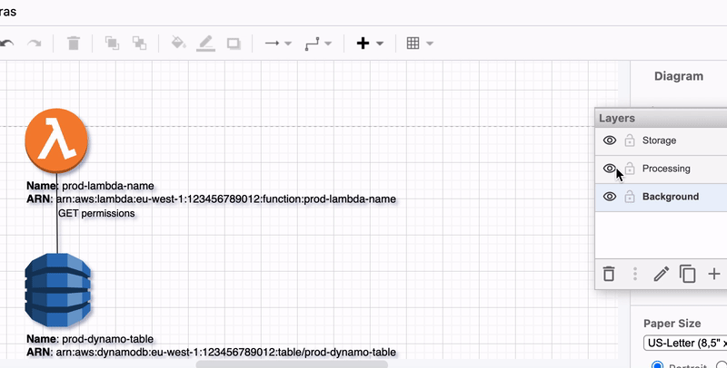

# Layers
{: .d-inline-block }

New (v0.3.10)
{: .label .label-green }

Layers enable the division of infrastructure representation into segmented domains, each with a specific focus on functionality or system attributes.

The following example illustrates the utilization of layers to show the progression of ``api-gateway`` flows, spanning from ``endpoints`` and ``methods`` to the storage system of ``DynamoDB``.
In this context, an additional "IAM" layer is incorporated at the apex, further enhancing the representation.


## Code Snippet:

Let's explore how to interact with layer starting from simple example - by adding 2 layers ``Storage`` and ``Processing`` with dedicated resources ``lambda function`` and ``dynamoDB`` for each layer: 

```python

```

## Rendering:



## Show/Hide Layers with assigned resources:



### Full XML dump:

```xml

```

### drawio file:

Download generated ``layer_3.drawio``:

[Download](output/drawio/layer_3.drawio){: .btn .btn-purple }

