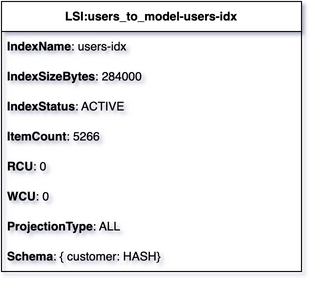

# List of Records
{: .d-inline-block .no_toc }

New (v0.2.0)
{: .label .label-green }

## Table of contents
{: .no_toc .text-delta }

1. TOC
{:toc}

---

{: .note }
Record are rows of text.

---

## Node Type: ``list``

## Rendering:



## Code Snippet:

```python

```

## drawio list vertex:

```xml
<mxCell id="vertex:LSI:users_to_model-users-idx:list" parent="1" vertex="1">
    <mxGeometry width="300" height="210" as="geometry"/>
</mxCell>
```
---

## Advanced for Geeks:

### Style:
```html
style="swimlane;fontStyle=0;childLayout=stackLayout;horizontal=1;startSize=30;horizontalStack=0;resizeParent=1;resizeParentMax=0;resizeLast=0;collapsible=1;marginBottom=0;whiteSpace=wrap;html=1;"
```

| attribute | value |
|:----------|:------|
|childLayout| stackLayout |
|collapsible| 1 |
|fontStyle| 0 |
|horizontal| 1 |
|horizontalStack| 0 |
|html| 1 |
|marginBottom| 0 |
|resizeLast| 0 |
|resizeParent| 1 |
|resizeParentMax| 0 |
|startSize| 30 |
|swimlane|  |
|whiteSpace| wrap |


### Full XML dump:
```xml
<mxfile host="multicloud-diagrams" agent="PIP package multicloud-diagrams. Generate resources in draw.io compatible format for Cloud infrastructure. Copyrights @ Roman Tsypuk 2023. MIT license." type="MultiCloud">
    <diagram id="diagram_1" name="AWS components">
        <mxGraphModel dx="1015" dy="661" grid="1" gridSize="10" guides="1" tooltips="1" connect="1" arrows="1" fold="1" page="1" pageScale="1" pageWidth="850" pageHeight="1100" math="0" shadow="1">
            <root>
                <mxCell id="0"/>
                <mxCell id="1" parent="0"/>
                <mxCell id="vertex:LSI:users_to_model-users-idx:list" value="&lt;b&gt;LSI:users_to_model-users-idx&lt;/b&gt;" style="swimlane;fontStyle=0;childLayout=stackLayout;horizontal=1;startSize=30;horizontalStack=0;resizeParent=1;resizeParentMax=0;resizeLast=0;collapsible=1;marginBottom=0;whiteSpace=wrap;html=1;" parent="1" vertex="1">
                    <mxGeometry width="300" height="210" as="geometry"/>
                </mxCell>
                <mxCell id="vertex:LSI:users_to_model-users-idx:row:0" value="IndexName" style="text;strokeColor=none;fillColor=none;align=left;verticalAlign=middle;spacingLeft=4;spacingRight=4;overflow=hidden;portConstraint=eastwest;rotatable=0;whiteSpace=wrap;html=1;" parent="vertex:LSI:users_to_model-users-idx:list" vertex="1">
                    <mxGeometry width="300" height="30" y="30" as="geometry"/>
                </mxCell>
                <mxCell id="vertex:LSI:users_to_model-users-idx:row:1" value="IndexSizeBytes" style="text;strokeColor=none;fillColor=none;align=left;verticalAlign=middle;spacingLeft=4;spacingRight=4;overflow=hidden;portConstraint=eastwest;rotatable=0;whiteSpace=wrap;html=1;" parent="vertex:LSI:users_to_model-users-idx:list" vertex="1">
                    <mxGeometry width="300" height="30" y="60" as="geometry"/>
                </mxCell>
                <mxCell id="vertex:LSI:users_to_model-users-idx:row:2" value="IndexStatus" style="text;strokeColor=none;fillColor=none;align=left;verticalAlign=middle;spacingLeft=4;spacingRight=4;overflow=hidden;portConstraint=eastwest;rotatable=0;whiteSpace=wrap;html=1;" parent="vertex:LSI:users_to_model-users-idx:list" vertex="1">
                    <mxGeometry width="300" height="30" y="90" as="geometry"/>
                </mxCell>
                <mxCell id="vertex:LSI:users_to_model-users-idx:row:3" value="ItemCount" style="text;strokeColor=none;fillColor=none;align=left;verticalAlign=middle;spacingLeft=4;spacingRight=4;overflow=hidden;portConstraint=eastwest;rotatable=0;whiteSpace=wrap;html=1;" parent="vertex:LSI:users_to_model-users-idx:list" vertex="1">
                    <mxGeometry width="300" height="30" y="120" as="geometry"/>
                </mxCell>
                <mxCell id="vertex:LSI:users_to_model-users-idx:row:4" value="RCU" style="text;strokeColor=none;fillColor=none;align=left;verticalAlign=middle;spacingLeft=4;spacingRight=4;overflow=hidden;portConstraint=eastwest;rotatable=0;whiteSpace=wrap;html=1;" parent="vertex:LSI:users_to_model-users-idx:list" vertex="1">
                    <mxGeometry width="300" height="30" y="150" as="geometry"/>
                </mxCell>
                <mxCell id="vertex:LSI:users_to_model-users-idx:row:5" value="WCU" style="text;strokeColor=none;fillColor=none;align=left;verticalAlign=middle;spacingLeft=4;spacingRight=4;overflow=hidden;portConstraint=eastwest;rotatable=0;whiteSpace=wrap;html=1;" parent="vertex:LSI:users_to_model-users-idx:list" vertex="1">
                    <mxGeometry width="300" height="30" y="180" as="geometry"/>
                </mxCell>
            </root>
        </mxGraphModel>
    </diagram>
</mxfile>
```

### drawio file:

Download generated ``list.drawio``:

[Download](output/drawio/list.drawio){: .btn .btn-purple }