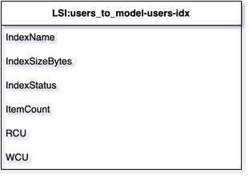

# List of Records
{: .d-inline-block }

New (v0.2.0)
{: .label .label-green }

{: .note }
Record is divided with ':' into key/value pairs. Each KEY is highlighted with bold font syntax.

---

## Node Type: ``list``

## Code Snippet:

```python

```

## Rendering:



## drawio list vertex:

```xml
<mxCell id="vertex:LSI:users_to_model-users-idx:list" parent="1" vertex="1">
    <mxGeometry width="300" height="270" as="geometry"/>
</mxCell>
```
---

## Advanced for Geeks:

### Style:
```html
style="swimlane;fontStyle=0;childLayout=stackLayout;horizontal=1;startSize=30;horizontalStack=0;resizeParent=1;resizeParentMax=0;resizeLast=0;collapsible=1;marginBottom=0;whiteSpace=wrap;html=1;"
```

| attribute | value |
|:----------|:------|
|childLayout| stackLayout |
|collapsible| 1 |
|fontStyle| 0 |
|horizontal| 1 |
|horizontalStack| 0 |
|html| 1 |
|marginBottom| 0 |
|resizeLast| 0 |
|resizeParent| 1 |
|resizeParentMax| 0 |
|startSize| 30 |
|swimlane|  |
|whiteSpace| wrap |

### Vertex size:


### Full XML dump:
```xml
<mxfile host="multicloud-diagrams" agent="PIP package multicloud-diagrams. Generate resources in draw.io compatible format for Cloud infrastructure. Copyrights @ Roman Tsypuk 2023. MIT license." type="MultiCloud">
    <diagram id="diagram_1" name="AWS components">
        <mxGraphModel dx="1015" dy="661" grid="1" gridSize="10" guides="1" tooltips="1" connect="1" arrows="1" fold="1" page="1" pageScale="1" pageWidth="850" pageHeight="1100" math="0" shadow="1">
            <root>
                <mxCell id="0"/>
                <mxCell id="1" parent="0"/>
                <mxCell id="vertex:LSI:users_to_model-users-idx:list" value="&lt;b&gt;LSI:users_to_model-users-idx&lt;/b&gt;" style="swimlane;fontStyle=0;childLayout=stackLayout;horizontal=1;startSize=30;horizontalStack=0;resizeParent=1;resizeParentMax=0;resizeLast=0;collapsible=1;marginBottom=0;whiteSpace=wrap;html=1;" parent="1" vertex="1">
                    <mxGeometry width="300" height="270" as="geometry"/>
                </mxCell>
                <mxCell id="vertex:LSI:users_to_model-users-idx:row:0" value="&lt;b&gt;IndexName&lt;/b&gt;:  users-idx" style="text;strokeColor=none;fillColor=none;align=left;verticalAlign=middle;spacingLeft=4;spacingRight=4;overflow=hidden;portConstraint=eastwest;rotatable=0;whiteSpace=wrap;html=1;" parent="vertex:LSI:users_to_model-users-idx:list" vertex="1">
                    <mxGeometry width="300" height="30" y="30" as="geometry"/>
                </mxCell>
                <mxCell id="vertex:LSI:users_to_model-users-idx:row:1" value="&lt;b&gt;IndexSizeBytes&lt;/b&gt;:  284000" style="text;strokeColor=none;fillColor=none;align=left;verticalAlign=middle;spacingLeft=4;spacingRight=4;overflow=hidden;portConstraint=eastwest;rotatable=0;whiteSpace=wrap;html=1;" parent="vertex:LSI:users_to_model-users-idx:list" vertex="1">
                    <mxGeometry width="300" height="30" y="60" as="geometry"/>
                </mxCell>
                <mxCell id="vertex:LSI:users_to_model-users-idx:row:2" value="&lt;b&gt;IndexStatus&lt;/b&gt;:  ACTIVE" style="text;strokeColor=none;fillColor=none;align=left;verticalAlign=middle;spacingLeft=4;spacingRight=4;overflow=hidden;portConstraint=eastwest;rotatable=0;whiteSpace=wrap;html=1;" parent="vertex:LSI:users_to_model-users-idx:list" vertex="1">
                    <mxGeometry width="300" height="30" y="90" as="geometry"/>
                </mxCell>
                <mxCell id="vertex:LSI:users_to_model-users-idx:row:3" value="&lt;b&gt;ItemCount&lt;/b&gt;:  5266" style="text;strokeColor=none;fillColor=none;align=left;verticalAlign=middle;spacingLeft=4;spacingRight=4;overflow=hidden;portConstraint=eastwest;rotatable=0;whiteSpace=wrap;html=1;" parent="vertex:LSI:users_to_model-users-idx:list" vertex="1">
                    <mxGeometry width="300" height="30" y="120" as="geometry"/>
                </mxCell>
                <mxCell id="vertex:LSI:users_to_model-users-idx:row:4" value="&lt;b&gt;RCU&lt;/b&gt;:  0" style="text;strokeColor=none;fillColor=none;align=left;verticalAlign=middle;spacingLeft=4;spacingRight=4;overflow=hidden;portConstraint=eastwest;rotatable=0;whiteSpace=wrap;html=1;" parent="vertex:LSI:users_to_model-users-idx:list" vertex="1">
                    <mxGeometry width="300" height="30" y="150" as="geometry"/>
                </mxCell>
                <mxCell id="vertex:LSI:users_to_model-users-idx:row:5" value="&lt;b&gt;WCU&lt;/b&gt;:  0" style="text;strokeColor=none;fillColor=none;align=left;verticalAlign=middle;spacingLeft=4;spacingRight=4;overflow=hidden;portConstraint=eastwest;rotatable=0;whiteSpace=wrap;html=1;" parent="vertex:LSI:users_to_model-users-idx:list" vertex="1">
                    <mxGeometry width="300" height="30" y="180" as="geometry"/>
                </mxCell>
                <mxCell id="vertex:LSI:users_to_model-users-idx:row:6" value="&lt;b&gt;ProjectionType&lt;/b&gt;:  ALL" style="text;strokeColor=none;fillColor=none;align=left;verticalAlign=middle;spacingLeft=4;spacingRight=4;overflow=hidden;portConstraint=eastwest;rotatable=0;whiteSpace=wrap;html=1;" parent="vertex:LSI:users_to_model-users-idx:list" vertex="1">
                    <mxGeometry width="300" height="30" y="210" as="geometry"/>
                </mxCell>
                <mxCell id="vertex:LSI:users_to_model-users-idx:row:7" value="&lt;b&gt;Schema&lt;/b&gt;:  { customer: HASH}" style="text;strokeColor=none;fillColor=none;align=left;verticalAlign=middle;spacingLeft=4;spacingRight=4;overflow=hidden;portConstraint=eastwest;rotatable=0;whiteSpace=wrap;html=1;" parent="vertex:LSI:users_to_model-users-idx:list" vertex="1">
                    <mxGeometry width="300" height="30" y="240" as="geometry"/>
                </mxCell>
            </root>
        </mxGraphModel>
    </diagram>
</mxfile>
```

### drawio file:

Download generated ``list.drawio``:

[Download](output/drawio/list.drawio){: .btn .btn-purple }