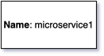

# Block Rectangle
{: .d-inline-block .no_toc }

New (v0.3.20)
{: .label .label-green }

## Table of contents
{: .no_toc .text-delta }

1. TOC
{:toc}

---


## Node Type: ``rectangle``

## Rendering:



## Code Snippet:

```python

```

## drawio rectangle vertex:

```xml
<mxCell id="vertex:rectangle:rect1" parent="1" vertex="1">
    <mxGeometry width="120" height="60" as="geometry"/>
</mxCell>
```
---

## Advanced for Geeks:

### Style:
```html
style="rounded=0;whiteSpace=wrap;html=1;labelBackgroundColor=none;"
```

| attribute | value |
|:----------|:------|
|html| 1 |
|labelBackgroundColor| none |
|rounded| 0 |
|whiteSpace| wrap |

### Vertex size:

| attribute | value |
|:---------|:-----------|
| width    | 120  |
| height   |60|

### Full XML dump:
```xml
<mxfile host="multicloud-diagrams" agent="PIP package multicloud-diagrams. Generate resources in draw.io compatible format for Cloud infrastructure. Copyrights @ Roman Tsypuk 2023. MIT license." type="MultiCloud">
    <diagram id="diagram_1" name="AWS components">
        <mxGraphModel dx="1015" dy="661" grid="1" gridSize="10" guides="1" tooltips="1" connect="1" arrows="1" fold="1" page="1" pageScale="1" pageWidth="850" pageHeight="1100" math="0" shadow="1">
            <root>
                <mxCell id="0"/>
                <mxCell id="1" parent="0"/>
                <mxCell id="vertex:rectangle:rect1" value="&lt;b&gt;Name&lt;/b&gt;: microservice1&lt;BR&gt;&lt;b&gt;ID&lt;/b&gt;: rect1" style="rounded=0;whiteSpace=wrap;html=1;labelBackgroundColor=none;" parent="1" vertex="1">
                    <mxGeometry width="120" height="60" as="geometry"/>
                </mxCell>
            </root>
        </mxGraphModel>
    </diagram>
</mxfile>
```

### drawio file:

Download generated ``rectangle.drawio``:

[Download](output/drawio/rectangle.drawio){: .btn .btn-purple }