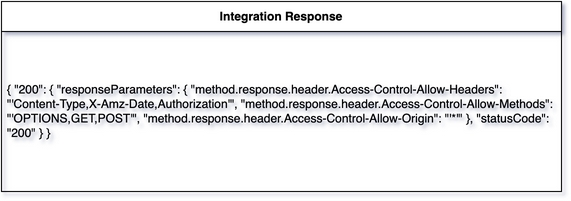

# Single Snapshot
{: .d-inline-block }

New (v0.3.8)
{: .label .label-green }

{: .note }
Single row table with a snapshot representation of XML, JSON or text/plain.
## Node Type: ``snapshot``

## Code Snippet:

```python

```

## Rendering:



## drawio snapshot vertex:

```xml
<?xml version="1.0" ?>
<mxCell id="vertex:Integration Response:list" parent="1" vertex="1">
    <mxGeometry width="560" height="190" as="geometry" x="-180"/>
</mxCell>
```

## Advanced for Geeks:

### Style:
```html
style="swimlane;fontStyle=0;childLayout=stackLayout;horizontal=1;startSize=30;horizontalStack=0;resizeParent=1;resizeParentMax=0;resizeLast=0;collapsible=1;marginBottom=0;whiteSpace=wrap;html=1;"
```

| attribute | value |
|:----------|:------|
|childLayout| stackLayout |
|collapsible| 1 |
|fontStyle| 0 |
|horizontal| 1 |
|horizontalStack| 0 |
|html| 1 |
|marginBottom| 0 |
|resizeLast| 0 |
|resizeParent| 1 |
|resizeParentMax| 0 |
|startSize| 30 |
|swimlane|  |
|whiteSpace| wrap |

### Vertex size:


### Full XML dump:
```xml
        <?xml version="1.0" ?>
<mxfile host="multicloud-diagrams" agent="PIP package multicloud-diagrams. Generate resources in draw.io compatible format for Cloud infrastructure. Copyrights @ Roman Tsypuk 2023. MIT license." type="MultiCloud">
    <diagram id="diagram_1" name="AWS components">
        <mxGraphModel dx="1015" dy="661" grid="1" gridSize="10" guides="1" tooltips="1" connect="1" arrows="1" fold="1" page="1" pageScale="1" pageWidth="850" pageHeight="1100" math="0" shadow="1">
            <root>
                <mxCell id="0"/>
                <mxCell id="1" parent="0"/>
                <mxCell id="vertex:Integration Response:list" value="&lt;b&gt;Integration Response&lt;/b&gt;" style="swimlane;fontStyle=0;childLayout=stackLayout;horizontal=1;startSize=30;horizontalStack=0;resizeParent=1;resizeParentMax=0;resizeLast=0;collapsible=1;marginBottom=0;whiteSpace=wrap;html=1;" parent="1" vertex="1">
                    <mxGeometry width="560" height="190" as="geometry" x="-180"/>
                </mxCell>
                <mxCell id="vertex:Integration Response:row:1" value="{
    &quot;200&quot;: {
        &quot;responseParameters&quot;: {
            &quot;method.response.header.Access-Control-Allow-Headers&quot;: &quot;'Content-Type,X-Amz-Date,Authorization'&quot;,
            &quot;method.response.header.Access-Control-Allow-Methods&quot;: &quot;'OPTIONS,GET,POST'&quot;,
            &quot;method.response.header.Access-Control-Allow-Origin&quot;: &quot;'*'&quot;
        },
        &quot;statusCode&quot;: &quot;200&quot;
    }
}" style="text;strokeColor=none;fillColor=none;align=left;verticalAlign=middle;spacingLeft=4;spacingRight=4;overflow=hidden;portConstraint=eastwest;rotatable=0;whiteSpace=wrap;html=1;" parent="vertex:Integration Response:list" vertex="1">
                    <mxGeometry width="560" height="160" y="30" as="geometry"/>
                </mxCell>
            </root>
        </mxGraphModel>
    </diagram>
</mxfile>
```

### drawio file:

Download generated ``snapshot.drawio``:

[Download](output/drawio/snapshot.drawio){: .btn .btn-purple }