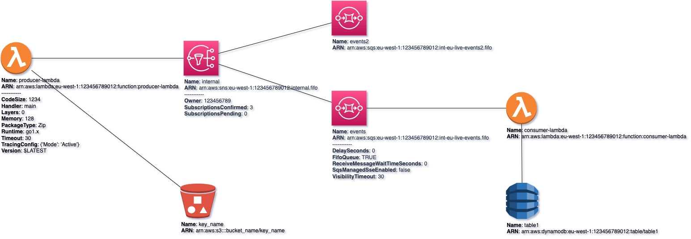
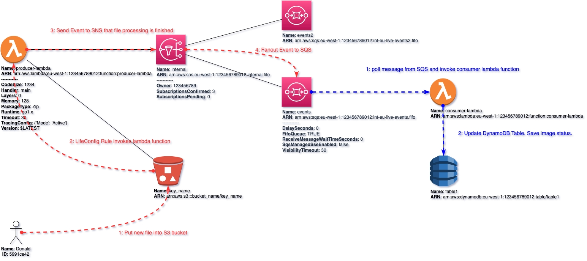

## UML ingestion from mermaid format

{: .d-inline-block .no_toc }

New (v0.3.15)
{: .label .label-green }

## Table of contents
{: .no_toc .text-delta }

1. TOC
{:toc}

---


{: .note }
Record are rows of text.

---

Latest ``Multicloud-diagrams`` feature allows automatically parse sequence UML diagrams, detect actors, actions and represent them on source Diagram as additional connected nodes with aliases.
This makes documenting infrastructure even more robust.

## Source infrastructure Diagram:

We have existing infrastructure diagram that describes ``AWS`` components of architecture:
- [diagram drawio](output/drawio/output.prod.end2end.drawio)



## Mermaid UML Diagrams

Following UML diagram in ``mermaid`` format describes ``File upload`` stage:
- [file_upload.mermaid](../samples/samples/file_upload.mermaid)

### Mermaid UML rendered diagram:

```mermaid

```

### Advanced for Geeks(Mermaid UML sources):

```

```

Next UML diagram in ``mermaid`` format describes ``Processing`` stage:
- [file_upload.mermaid](../samples/samples/process.mermaid)

### Mermaid UML rendered diagram:

```mermaid

```

### Advanced for Geeks(Mermaid UML sources):

```

```

## Ingesting UML metadata into multicloud-diagrams:

### Load initial ``drawio`` infra diagram

As usual, we create a new diagram using ``Diagrams-As-a-Code`` or open exising one:

```python

```

### Define mappings 

Now it is time to define mappings between diagram elements ``ID``s and aliases used in ``UML`` sequence diagram.

```python

```

### Mapping format structure 

Mappings are defined in ``yaml`` format, they specify relations between ``actor`` from UML and ``node_id`` from diagrams.

```yaml

```

### Generate MetaInformation Layer

For each UML diagram, ``multicloud-diagrams`` will created ``Layer`` in ``draw-io`` and augment relations and actions to existing elements.

Customization of colors, fonts, arrows are fully supported. In this example we are creating distinct styles for each UML diagram (they will be rendered with different colors).

```python

```

Augment second ``UML`` diagram into ``multicloud-diagrams`` with different styles instrumented.

```python

```

There is option to overwrite the same file or produce a new one. We will use the second option.

```python

```

### Result File



### Fully Editable Diagram with Layers from UML

Each layer has a name of UML file that we ingested, all actions from each UML are marked with numbers, customized with colors and added on top of existing infra elements (draggable, editable):


---
