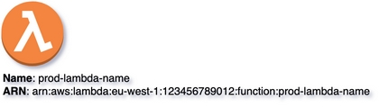
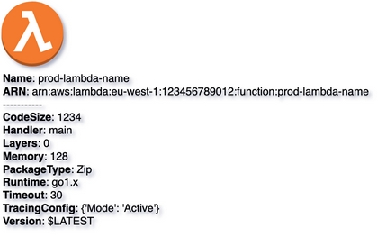
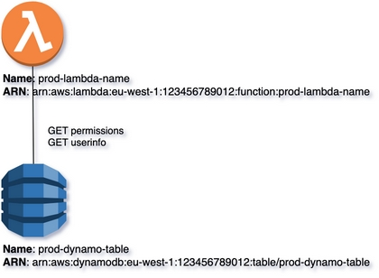

# Vertices & Edges
{: .no_toc}

## Table of contents
{: .no_toc .text-delta }

1. TOC
{:toc}

---

{: .highlight }
Vertices & Edges are core components of ``multicloud-diagrams`` framework. It supports ingestion of these elements 
through programming API or from YAML-based files.

## Vertex

```python
def add_vertex(self, node_id: str, node_name: str, metadata: dict = None, 
               node_type: str = '', layer_name: str = None, layer_id: str = None, 
               style: dict = None, x: int = None, y: int = None)
```

| Mandatory     |                                                                                                                                                                                                       |
|:--------------|:------------------------------------------------------------------------------------------------------------------------------------------------------------------------------------------------------|
| **node_id**   | unique identifier (FQDN, URL, ARN, etc.) - unique in entire diagram                                                                                                                                   |
| **node_name** | any value (FQDN, URL, alpha-numeric value, etc.)                                                                                                                                                      |
| **node_type** | there is a defined list of supported node_types for rendering (**dynamodb**, **lambda_function**, etc.), if node type is not supported, fallback will be used. Each node on documentation page has node_type. |

| Optional       |                                                                                                                                                               |
|:---------------|:--------------------------------------------------------------------------------------------------------------------------------------------------------------|
| **metadata**   | key/value pairs used to represent additional information                                                                                                      |
| **layer_name** | vertices can be added to specific layer, if not specified the default layer is used                                                                           |
| **layer_id**   | for programmatic access layers can be referenced also by ID                                                                                                   |
| **style**      | if specified changes default Vertex styling (color, fillColor, opacity, etc.) Check [Customization](../core-components/colors.html) section for more details. |
| **x**          | positioning Vertex on palette                                                                                                                                 |
| **y**          | positioning Vertex on palette                                                                                                                                 |

### Vertex without Metadata:


### Code Snippet
{: .no_toc}

```python

```

### Rendering:
{: .no_toc}



### Vertex with Metadata:

### Code Snippet
{: .no_toc}

``Metadata`` is represented as dictionary of key/value pairs. When rendering ``key`` is be marked with bold, each key/value pair
is located on dedicated line.

```python

```

### Rendering:
{: .no_toc}



## Edge

```python
def add_link(self, src_node_id, dst_node_id, action=None)
```

| Mandatory Attributes |                  |
|:---------------------|:-----------------|
| **src_node_id**      | RESOURCE_TYPE:ID |
| **dst_node_id**      | RESOURCE_TYPE:ID |

| Optional Attributes |          |
|:--------------------|:---------|
| **action**          | string[] |


``Vertices`` are connected using ``Edges``. Such edge is build by specifying ``source`` and ``target`` Vertex IDs. These connections, also can have a series of labels to describe the relation or actions.

``node_id`` has the following syntax: ``<RESOURCE_TYPE>:<ID>``. Examples:

```python
'lambda_function:arn:aws:lambda:eu-west-1:123456789012:function:prod-lambda-name',
'dynamo:arn:aws:dynamodb:eu-west-1:123456789012:table/prod-dynamo-table',
```

### Edge with Label of Actions:

### Code Snippet
{: .no_toc}

```python

```

### Rendering:
{: .no_toc}



{: .highlight }
The comprehensive compilation of supported Components, accompanied by their respective syntax, enriched with illustrative code snippets, rendering previews, and credible sources,
can be found on appropriate section of this documentation:
- [``CORE Components``](../core-components)
- [``AWS Components``](../aws-components)
- [``On-Prem Components``](../onprem-components)
