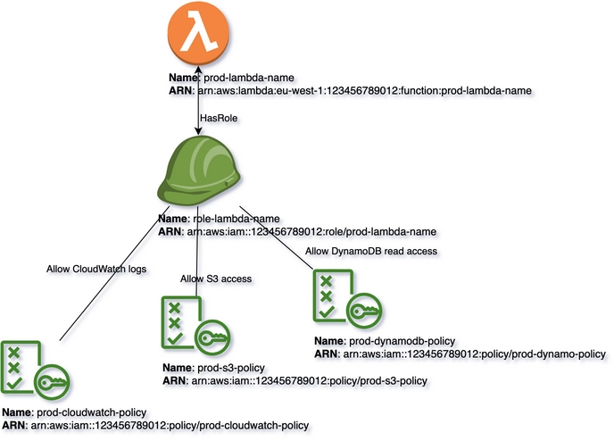
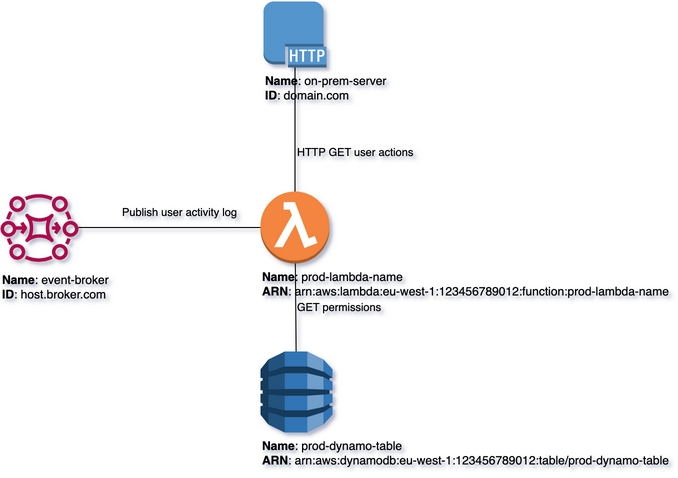
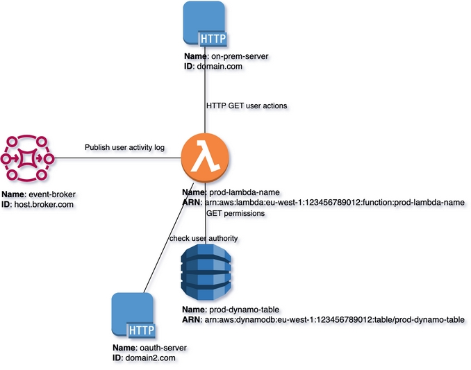

# Load resources from YAML file
{: .d-inline-block .no_toc}

New (v0.3.8)
{: .label .label-green }

## Table of contents
{: .no_toc .text-delta }

1. TOC
{:toc}

---

{: .highlight }
Ingest extra resources from yaml configuration into DRAWIO diagram. Allows to add vertices and edges to empty diagram
or to existing one. To cover the case if there are relationships that you can not programmatically query but want to visualtize.

{: .note-title }
> ``YAML``-format supports declaration using 3 forms dialects for vertices and edges and also any mix of them:
>- src/dst are linked to yaml vertices by name
>- src/dst are linked by ARN (ARN can be present in same yaml, or loaded programmatically)
>- mixed of 1st and 2nd


## Option 1: All resources are from YAML
{: .d-inline-block }

All of these dialects are present in the first ``yaml`` snippet:

## yaml file with declaration of resource:
{: .no_toc}

```yaml

```

## Code Snippet:
{: .highlight .no_toc}

``read_coords_from_file`` is used for positioning Vertices - coordinates from previous version ``drawio`` file will be reused for
Vertices that have same ``ID``. This function does not reload Vertices from previous version, it only operates with coordinates history.

```python

```

## Rendering:
{: .no_toc}




### drawio file:
{: .no_toc}

Download generated ``yaml.drawio``:

[Download](output/drawio/yaml.drawio){: .btn .btn-purple }

## Option 2: resources are in the code (Diagrams as a Code), additionally augmented from YAML

{: .highlight }
Other option is to combine Diagrams as Code (DaC) by declaring all resources in code and also ingest additional vertices from YAML file.
This is very useful when you have custom resources that are not supported by libraries to query (not available in ``boto3`` or on-prem resources).

## yaml file with resources declaration:
{: .no_toc}

```yaml

```

## Code Snippet:
{: .no_toc}

```python

```

## Rendering:
{: .no_toc}




### drawio file:
{: .no_toc}

Download generated ``yaml2.drawio``:

[Download](output/drawio/yaml2.drawio){: .btn .btn-purple }


## Option 3: Existing diagram has all resources, additionally augmented from YAML

{: .highlight }
We already have ``drawio`` file with rendered resources (from previous example).
Now we want to instrument ``multicloud-diagrams`` that there are additional resources that are declared in ``yaml`` that should be added.
Previous resources will stay in ``drawio`` diagram, ``yaml``-based resources will be added to existing one.

## yaml file with resources declaration:
{: .no_toc}

```yaml

```

## Code Snippet:
{: .no_toc}

```python

```

## Rendering:
{: .no_toc}




### drawio file:
{: .no_toc}

Download generated ``yaml3.drawio``:

[Download](output/drawio/yaml3.drawio){: .btn .btn-purple }
