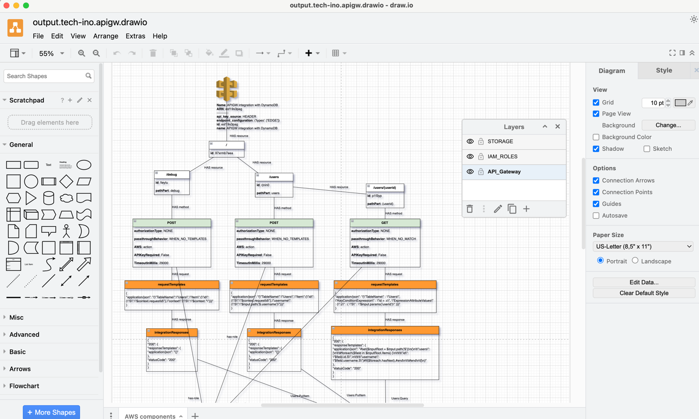
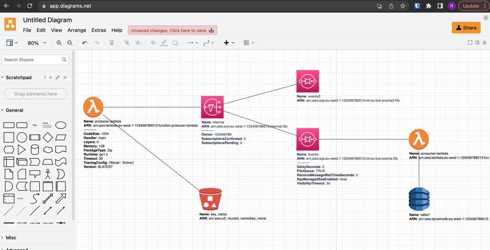
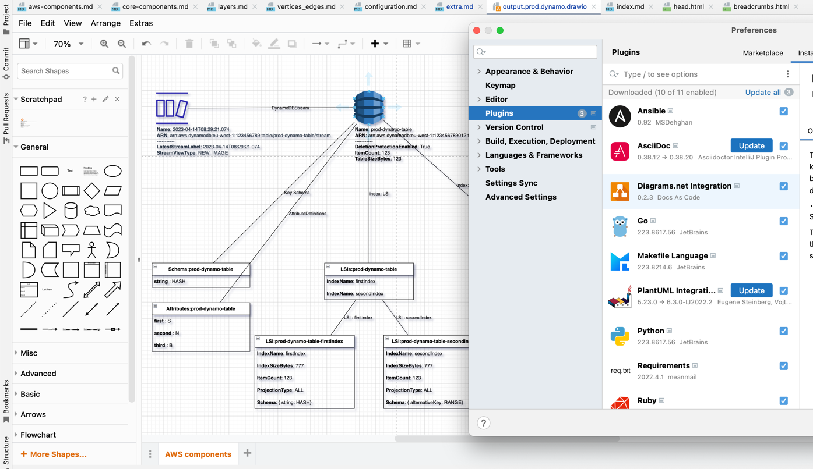

# DRAWIO How To
{: .no_toc }

Draw.io has gained widespread popularity as an extensively used editor and file format. Apart from the standard web browser version, it offers various other scenarios for usage, which include:

## Table of contents
{: .no_toc .text-delta }

1. TOC
{:toc}
---


## Offline draw.io installation

DrawIO is available for installation as standalone app: [https://github.com/jgraph/drawio-desktop/releases/](https://github.com/jgraph/drawio-desktop/releases/).

MacOS command to install:

```shell
brew cask install drawio
```



## draw.io as CLI

Also, not many users are aware, but you can use installed DrawIO app as a command-line tool.
Here we are converting the vector representation of a ``landscape.drawio`` file into an output ``PNG`` file, while scaling its size to be twice as large
(you define and use ``short`` or ``alias`` in ``CLI`` instead of specifying the full path):

```shell
/Applications/draw.io.app/Contents/MacOS/draw.io -x --border 2 -f png --scale 2 -o landscape.png landscape.drawio
```

{: .highlight }
Very useful to use in automated Pipelines, to convert diagrams into desired output format (png, pdf, jpg, msvg, vsdx, xml) of you ``catalogue`` representation. 

Other available CLI arguments:

| argument                | description                                                                                                                                                                                        |
|:------------------------|:---------------------------------------------------------------------------------------------------------------------------------------------------------------------------------------------------|
| -f, --format <format>   | if output file name extension is specified, this option is ignored (file type is determined from output extension, possible export formats are pdf, png, jpg, svg, vsdx, and xml) (default: "pdf") |
| -q, --quality <quality> | output image quality for JPEG (default: 90)                                                                                                                                                        |
| t, --transparent        | set transparent background for PNG                                                                                                                                                                 |
| -b, --border <border>   | sets the border width around the diagram (default: 0)                                                                                                                                              |
| -s, --scale <scale>     | scales the diagram size                                                                                                                                                                            |
| --width <width>         | fits the generated image/pdf into the specified width, preserves aspect ratio.                                                                                                                     |
| --height <height>       | fits the generated image/pdf into the specified height, preserves aspect ratio.                                                                                                                    |

## draw.io in any  browser

The browser version is likely the most widely used one, as I've observed numerous engineers start their journey from it.
Also, useful when you are on another setup (any machine has ``browser``).

Simply go to: [https://app.diagrams.net/](https://app.diagrams.net/)



## IntelliJ IDEA drawio plugin


