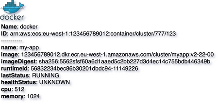

# Docker container
{: .d-inline-block .no_toc }

New (v0.3.19)
{: .label .label-green }

## Table of contents
{: .no_toc .text-delta }

1. TOC
{:toc}

---


## Node Type: ``docker``

## Rendering:



## Code Snippet:

```python

```

## drawio docker vertex:

```xml
<mxCell id="vertex:docker:arn:aws:ecs:eu-west-1:123456789012:container/cluster/777/123" parent="1" vertex="1">
    <mxGeometry width="50" height="41" as="geometry"/>
</mxCell>
```
---

## Advanced for Geeks:

### Style:
```html
style="sketch=0;aspect=fixed;html=1;points=[];align=left;image;fontSize=12;image=img/lib/mscae/Docker.svg;labelBackgroundColor=none;"
```

| attribute | value |
|:----------|:------|
|align| left |
|aspect| fixed |
|fontSize| 12 |
|html| 1 |
|image|  |
|image| img/lib/mscae/Docker.svg |
|labelBackgroundColor| none |
|points| [] |
|sketch| 0 |

### Vertex size:

| attribute | value |
|:---------|:-----------|
| width    | 50  |
| height   |41|

### Full XML dump:
```xml
<mxfile host="multicloud-diagrams" agent="PIP package multicloud-diagrams. Generate resources in draw.io compatible format for Cloud infrastructure. Copyrights @ Roman Tsypuk 2023. MIT license." type="MultiCloud">
    <diagram id="diagram_1" name="AWS components">
        <mxGraphModel dx="1015" dy="661" grid="1" gridSize="10" guides="1" tooltips="1" connect="1" arrows="1" fold="1" page="1" pageScale="1" pageWidth="850" pageHeight="1100" math="0" shadow="1">
            <root>
                <mxCell id="0"/>
                <mxCell id="1" parent="0"/>
                <mxCell id="vertex:docker:arn:aws:ecs:eu-west-1:123456789012:container/cluster/777/123" value="&lt;b&gt;Name&lt;/b&gt;: docker&lt;BR&gt;&lt;b&gt;ID&lt;/b&gt;: arn:aws:ecs:eu-west-1:123456789012:container/cluster/777/123&lt;BR&gt;-----------&lt;BR&gt;&lt;b&gt;name&lt;/b&gt;: my-app&lt;BR&gt;&lt;b&gt;image&lt;/b&gt;: 123456789012.dkr.ecr.eu-west-1.amazonaws.com/cluster/myapp:v2-22-00&lt;BR&gt;&lt;b&gt;imageDigest&lt;/b&gt;: sha256:5562sfsf60a6d1aaed5c2bb227d3d4ec14c755bdb446349b&lt;BR&gt;&lt;b&gt;runtimeId&lt;/b&gt;: 56832234bec86b30201dbdc94-11149226&lt;BR&gt;&lt;b&gt;lastStatus&lt;/b&gt;: RUNNING&lt;BR&gt;&lt;b&gt;healthStatus&lt;/b&gt;: UNKNOWN&lt;BR&gt;&lt;b&gt;cpu&lt;/b&gt;: 512&lt;BR&gt;&lt;b&gt;memory&lt;/b&gt;: 1024" style="sketch=0;aspect=fixed;html=1;points=[];align=left;image;fontSize=12;image=img/lib/mscae/Docker.svg;labelBackgroundColor=none;" parent="1" vertex="1">
                    <mxGeometry width="50" height="41" as="geometry"/>
                </mxCell>
            </root>
        </mxGraphModel>
    </diagram>
</mxfile>
```

### drawio file:

Download generated ``docker.drawio``:

[Download](output/drawio/docker.drawio){: .btn .btn-purple }