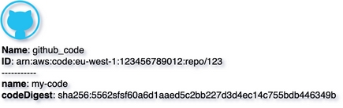

# Github code
{: .d-inline-block .no_toc }

New (v0.3.22)
{: .label .label-green }

## Table of contents
{: .no_toc .text-delta }

1. TOC
{:toc}

---


## Node Type: ``github_code``

## Rendering:



## Code Snippet:

```python

```

## drawio github_code vertex:

```xml
<mxCell id="vertex:github_code:arn:aws:code:eu-west-1:123456789012:repo/123" parent="1" vertex="1">
    <mxGeometry width="50" height="50" as="geometry"/>
</mxCell>
```
---

## Advanced for Geeks:

### Style:
```html
style="verticalLabelPosition=bottom;html=1;verticalAlign=top;align=left;strokeColor=none;fillColor=#00BEF2;shape=mxgraph.azure.github_code;pointerEvents=1;"
```

| attribute | value |
|:----------|:------|
|align| left |
|fillColor| #00BEF2 |
|html| 1 |
|pointerEvents| 1 |
|shape| mxgraph.azure.github_code |
|strokeColor| none |
|verticalAlign| top |
|verticalLabelPosition| bottom |

### Vertex size:

| attribute | value |
|:---------|:-----------|
| width    | 50  |
| height   |50|

### Full XML dump:
```xml
<mxfile host="multicloud-diagrams" agent="PIP package multicloud-diagrams. Generate resources in draw.io compatible format for Cloud infrastructure. Copyrights @ Roman Tsypuk 2023. MIT license." type="MultiCloud">
    <diagram id="diagram_1" name="AWS components">
        <mxGraphModel dx="1015" dy="661" grid="1" gridSize="10" guides="1" tooltips="1" connect="1" arrows="1" fold="1" page="1" pageScale="1" pageWidth="850" pageHeight="1100" math="0" shadow="1">
            <root>
                <mxCell id="0"/>
                <mxCell id="1" parent="0"/>
                <mxCell id="vertex:github_code:arn:aws:code:eu-west-1:123456789012:repo/123" value="&lt;b&gt;Name&lt;/b&gt;: github_code&lt;BR&gt;&lt;b&gt;ID&lt;/b&gt;: arn:aws:code:eu-west-1:123456789012:repo/123&lt;BR&gt;-----------&lt;BR&gt;&lt;b&gt;name&lt;/b&gt;: my-code&lt;BR&gt;&lt;b&gt;codeDigest&lt;/b&gt;: sha256:5562sfsf60a6d1aaed5c2bb227d3d4ec14c755bdb446349b" style="verticalLabelPosition=bottom;html=1;verticalAlign=top;align=left;strokeColor=none;fillColor=#00BEF2;shape=mxgraph.azure.github_code;pointerEvents=1;" parent="1" vertex="1">
                    <mxGeometry width="50" height="50" as="geometry"/>
                </mxCell>
            </root>
        </mxGraphModel>
    </diagram>
</mxfile>
```

### drawio file:

Download generated ``github_code.drawio``:

[Download](output/drawio/github_code.drawio){: .btn .btn-purple }