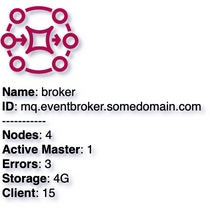

# MQ Broker
{: .d-inline-block }

New (v0.3.3)
{: .label .label-green }

## Node Type: ``mq_broker``

## Code Snippet:

```python

```

## Rendering:




## drawio mq_broker vertex:

```xml
<?xml version="1.0" ?>
<mxCell id="vertex:mq_broker:mq.eventbroker.somedomain.com" parent="1" vertex="1">
						
	<mxGeometry width="78" height="78" as="geometry"/>
					
</mxCell>

```

## Advanced for Geeks:

### Style:
```html
style="sketch=0;outlineConnect=0;fontColor=#232F3E;gradientColor=none;fillColor=#B0084D;strokeColor=none;dashed=0;verticalLabelPosition=bottom;verticalAlign=top;align=left;html=1;fontSize=12;fontStyle=0;aspect=fixed;pointerEvents=1;shape=mxgraph.aws4.mq_broker;"
```
### Vertex size:

| width     | height   |
|:----------|:---------|
| 78 | 78|

### Full XML dump:
```xml
        <?xml version="1.0" ?>
<mxfile host="multicloud-diagrams" agent="PIP package multicloud-diagrams. Generate resources in draw.io compatible format for Cloud infrastructure. Copyrights @ Roman Tsypuk 2023. MIT license." type="MultiCloud">
		
	<diagram id="diagram_1" name="AWS components">
				
		<mxGraphModel dx="1015" dy="661" grid="1" gridSize="10" guides="1" tooltips="1" connect="1" arrows="1" fold="1" page="1" pageScale="1" pageWidth="850" pageHeight="1100" math="0" shadow="1">
						
			<root>
								
				<mxCell id="0"/>
								
				<mxCell id="1" parent="0"/>
								
				<mxCell id="vertex:mq_broker:mq.eventbroker.somedomain.com" parent="1" vertex="1">
										
					<mxGeometry width="78" height="78" as="geometry"/>
									
				</mxCell>
							
			</root>
					
		</mxGraphModel>
			
	</diagram>
</mxfile>

```

### drawio file:

Download generated ``mq_broker.drawio``:

[Download](output/drawio/mq_broker.drawio){: .btn .btn-purple }