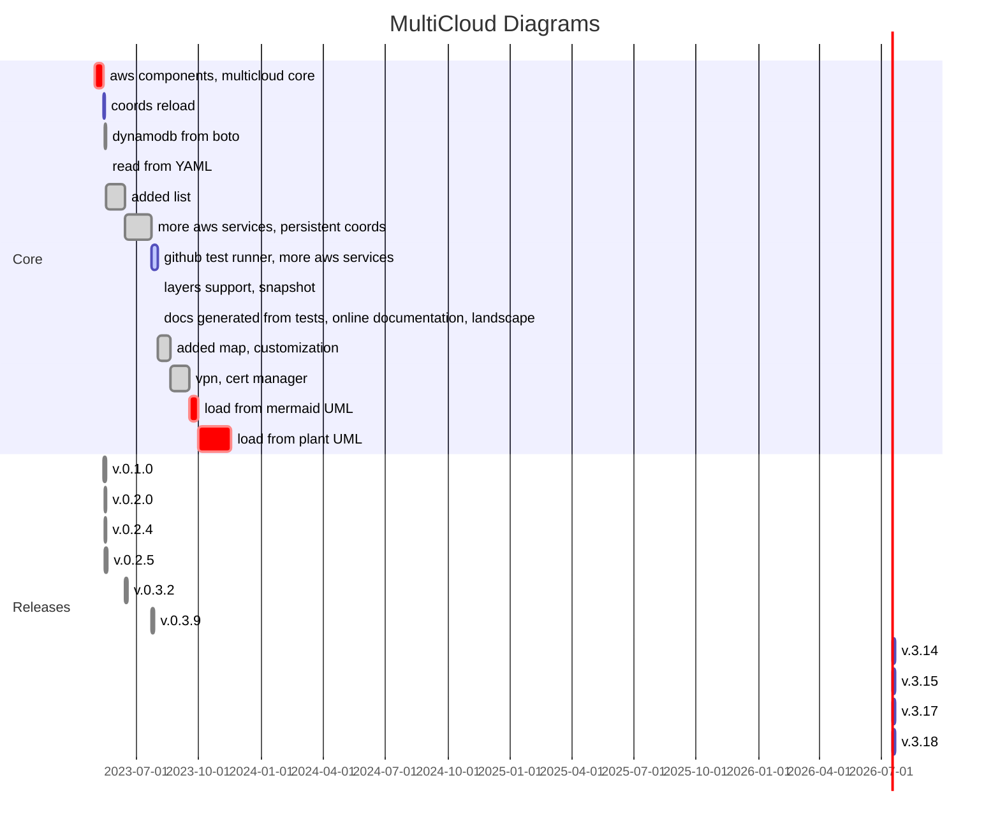

# Explore and Document Your Cloud Infrastructure with ``multicloud-diagrams``

---

{: .highlight }
As **Professional** **Architects**, **Developers** and **DevOps**  with experience in operating on **Public Cloud Providers**, we all recognize the **crucial importance** of **well-documented**
**Infrastructure** and **Architecture** in a representable form for driving successful projects. 

``multicloud-diagrams`` is a framework that combines multiple approaches: ``Diagrams as a Code`` (Dac), resources ingestion from external ``yaml`` sources, interaction through programmatic ``API`` integration.

It allows to store the Infrastructure snippet in ``drawio`` format, which is editable vector-based representation. 
Since source file is not a Raster form, it is easy to edit, customize, position elements based on our needs and track the history.

---

## Supported Nodes Landscape (Autogenerated on-release):

## AWS nodes:

## AWS2024 nodes:
### AWS2024 / Application Integration

### AWS2024 / Network & Content Delivery

### AWS2024 / Compute

### AWS2024 / Analytics

### AWS2024 / Machine Learning

## ONPREM nodes:

---
 
- **Documentation:** [https://tsypuk.github.io/multicloud-diagrams/docs/configuration.html](https://tsypuk.github.io/multicloud-diagrams/docs/configuration.html)
- **Source code:** [https://github.com/tsypuk/multicloud-diagrams](https://github.com/tsypuk/multicloud-diagrams)
- **PyPI multicloud-diagrams:** [https://pypi.org/project/multicloud-diagrams/](https://pypi.org/project/multicloud-diagrams/)
- **Bug reports:** [https://github.com/tsypuk/multicloud-diagrams/issues](https://github.com/tsypuk/multicloud-diagrams/issues)

---

## Support OS Project:

{: .highlight }
Support from sponsors is invaluable for the continued maintenance and development of open-source projects.
You can use any of most popular platforms: ``Patreon`` or ``Buy me a Cofee``, by following these links:

- 
- 

---

## Examples of diagrams generated using ``multicloud-diagrams``:

### End-to-End with AWS resources:

---

### API Gateway with integrations:

---

### DynamoDB Insights:

---

### Augment Diagram from UML:

---

## Project Evolution Timeline

---

## Supported Cloud Provides:

| provider                                                                                       | supported in ``multicloud-diagrams`` |
|:-----------------------------------------------------------------------------------------------|:-------------------------------------|
|           | **[x]** since project start          |
|              | **[x]** since **v0.2.1**             |
|  | **[  ]**                             |
|         | **[  ]**                             |

---

## Why ``multicloud-diagrams`` is written on Python?

The choice of Python as the programming language for our initial project was driven by several key factors that align seamlessly with our goals and requirements. Here's why Python was selected as the foundation for our project's development:

- **Seamless Integration and Data Ingestion using AWS Boto3** (official SDK for Amazon Web Services, developed in Python).
- **Simplicity**: Python's clean and readable syntax simplifies the development process.
  Its ease of use and elegant structure enable to focus on the core components without being bogged down by unnecessary complexities.
- **Broad Appeal among DevOps and Developers**: Python's popularity within the DevOps and Development communities is undeniable.
  Its extensive adoption is a testament to its effectiveness for building robust applications.
  By choosing Python, we cater to a broader audience, fostering collaboration and easing the learning curve for newcomers.
- **Cross-Platform Availability**: Python's cross-platform compatibility ensures that our project can be run on a wide array of environments without compatibility issues.
  Whether you're working on Windows, macOS, or Linux, Python's ubiquity guarantees consistent functionality across platforms.

## Why ``multicloud-diagrams`` chooses ``drawio`` as the Output Format?
During my exploration of various tools on this journey, I've encountered several options, each with its own set of advantages and compromises. However, after careful consideration, 
the decision to adopt the drawio format emerged as the optimal choice for several compelling reasons:

- **Editable form** of drawio format provides a great level of customization, enabling users to easily fine-tune diagrams to meet specific needs and scenarios.
- **Widespread Adoption**:  with a broad user base, drawio stands as one of the most widely used diagramming tools, ensuring familiarity and compatibility across diverse teams.
- **Enhanced Plugin and Tool Support**: the format seamlessly integrates with a set of plugins and tools, enriching the ecosystem with expanded capabilities and possibilities.
- **Compact File Sizes**: leveraging the drawio format results in compact file sizes, facilitating swift sharing and distribution without compromising visual quality.
- **Git-trackable Infrastructure Evolution**: allowing for efficient tracking and visualization of infrastructure mutations over time.
- **Smooth Compilation to Raster and other formats**: drawio supports out of the box converting to PNG, JPG, PDF, SVG, VSDX, XML

---

[//]: # (#### Thank you to the contributors of ``multicloud-diagrams``)

[//]: # (<ul class="list-style-none">)
[//]: # ()
[//]: # (  <li class="d-inline-block mr-1">)
[//]: # (     )
[//]: # (  </li>)
[//]: # ()
[//]: # (</ul>)

[//]: # ([View our Code of Conduct]&#40;https://github.com/tsypuk/multicloud-diagrams/tree/main/CODE_OF_CONDUCT.md&#41; on GitHub repository.)

[Jekyll]: https://jekyllrb.com
[Markdown]: https://daringfireball.net/projects/markdown/
[Liquid]: https://github.com/Shopify/liquid/wiki
[Front matter]: https://jekyllrb.com/docs/front-matter/
[Jekyll configuration]: https://jekyllrb.com/docs/configuration/
[multicloud-diagrams repo]: https://github.com/tsypuk/multicloud-diagrams
[GitHub Pages]: https://pages.github.com/
[GitHub Pages / Actions workflow]: https://github.blog/changelog/2022-07-27-github-pages-custom-github-actions-workflows-beta/
