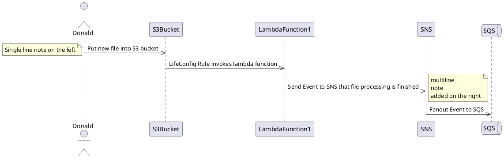
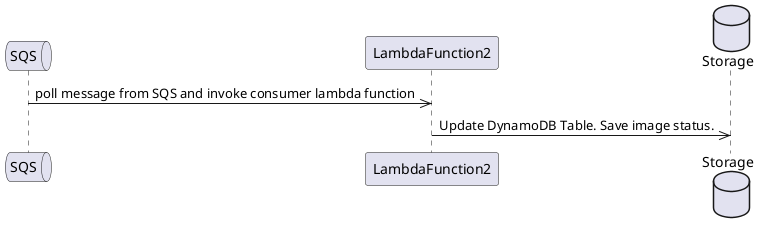

## Section

Section Text

## Section 2

Section Text

## Diagram

```plantuml
@startuml
actor Donald
    participant S3Bucket
    participant LambdaFunction1
    participant SNS
    queue SQS

    Donald->>S3Bucket: Put new file into S3 bucket
    note left: Single line note on the left
    S3Bucket->>LambdaFunction1: LifeConfig Rule invokes lambda function
    LambdaFunction1->>SNS: Send Event to SNS that file processing is finished
    note right
    multiline
    note
    added on the right
    end note
    SNS->>SQS: Fanout Event to SQS
@enduml
```

## Section 3

## Diagram

```plantuml
@startuml
    queue SQS
    participant LambdaFunction2
    database Storage

    SQS->>LambdaFunction2: poll message from SQS and invoke consumer lambda function
    LambdaFunction2->>Storage: Update DynamoDB Table. Save image status.
@enduml
```